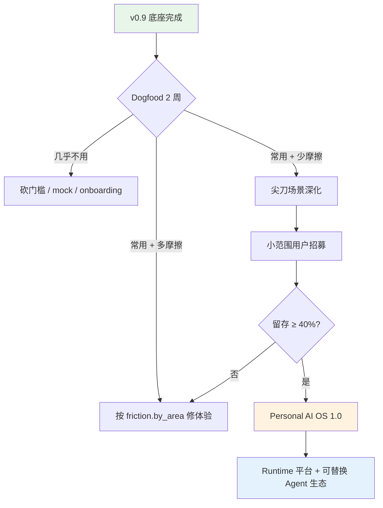

# Personal AI Runtime · 项目 Review

> **Review 日期：** 2026-06-14  
> **版本基线：** v0.9.0  
> **Review 范围：** 架构、代码质量、产品完成度、安全、测试、文档与演进方向  
> **核心问题：** 这个项目未来的路径和终点是什么？

> **技术债偿还复核（2026-06-14 计划）：** ✅ **计划主体已完成**（7 项全量 ✅ / 2 项 ⚠️ 余量；见下表）。产品验证（Dogfood）不在计划内。

### 技术债偿还状态一览

| 阶段 | 计划项 | 状态 | 证据 |
|:----:|--------|:----:|------|
| 1 | E2E mock 修复 + 纳入 CI | ✅ | `frontend/e2e/helpers.ts` MockApiRouter；6/6 E2E 通过；`.github/workflows/ci.yml` + `make test-e2e` |
| 2a | `make dev` health gate | ✅ | `scripts/wait_for_health.sh` + Makefile `dev` target |
| 2b | JS bundle 拆分 | ✅ | `vite.config.ts` manualChunks；`CodeBlock.tsx` 懒加载 syntax highlighter |
| 3a | notifications 事件溯源 | ✅ | `NotificationCreated/Read/…` + projector；`GOVERNED_TABLES` |
| 3b | schedules 事件溯源 | ✅ | `ScheduleCreated/LastRunUpdated` + scheduler_v2 改 emit_event |
| 3c | export/rebuild CI 扩展 | ✅ | `verify_export_roundtrip.py` 含 notifications；`snapshot_counts` 扩展 |
| 4a | agents 层 mypy | ✅ | CI/Makefile 含 brain/conversation/planner/critic/llm_router |
| 4b | 大文件拆分 | ⚠️ | `brain_completion.py` + projectors 四模块 ✅；**`mcp_hub.py` 未拆**（仍 ~557 行） |
| 4c | experimental Kernel 化 | ⚠️ | `self_improver` + `agent_gateway` ✅；browser/git capture 未迁移；**未接入生产** |

**复核结论：** 计划内工程交付项全部落地；4b/4c 各留一项已知余量（mcp_hub 拆分、connector 迁移），不影响 CI 门禁与边界守卫。后端 228 测试、前端 72 单元 + 6 E2E 全绿。

---

## 一、Executive Summary

**Personal AI Runtime** 不是一个普通的「ChatGPT 套壳」，而是一个有明确架构哲学的 **本地优先个人 AI 操作系统**。它的差异化不在功能数量，而在三件事：

1. **数据主权** —— 完整 Event Log 无损导出/导入，数据永远属于你
2. **Kernel 边界** —— Agent 永远不能直连存储，所有改动留痕、可重建
3. **治理优先** —— 高风险工具必须审批，外部内容带污点（taint）升级

当前处于 **v0.9.0 · 底座聚焦 + 自用验证（Dogfood）** 阶段。工程清单（原 ROADMAP）已基本完成；Kernel Boundary Debt = 0；224 个后端测试 + 前端类型检查/Vitest 通过。项目已从「搭底座」转向 **「用真实场景验证值不值得继续投」**。

**一句话判断：** 工程底子扎实、方向清晰，但产品价值尚未被真实使用数据验证。终点不是「又一个 AI 助手 App」，而是 **「个人 AI 的运行时层（Runtime Layer）—— 像 Linux 之于应用，Kernel 之于 Agent」**。

---

## 二、项目定位与终局愿景

### 2.1 它是什么

```text
User → Runtime Kernel (Event Log / State / Permissions)
         ├─ Agents (Brain, Planner, Critic — ephemeral)
         ├─ Capabilities (24 builtin + 24 external MCP tools)
         ├─ Apps (Inbox, Brief, Review, Dashboard, …)
         └─ Storage (SQLite + ChromaDB, 本地)
```

官方自我定义（见 `docs/RUNTIME_SPEC.md`）：

> **Agent 是功能。Runtime 才是平台。**  
> Features are Apps. Governance is Runtime.

### 2.2 终点是什么（三种可能的终局）

| 终局形态 | 描述 | 概率判断 |
|---------|------|---------|
| **A. 个人 AI OS（主路径）** | 单机/local-first 的个人 AI 运行时：对话、记忆、目标、收件箱、工具执行全部在本地；LLM/Agent 可换，Kernel ABI 不变；数据一键带走 | **最高** —— 与现有架构、文档、护城河完全一致 |
| **B. 尖刀产品** | 不做通用平台，把「智能收件箱 + 长期记忆对话」打磨成可被 5–20 人日常使用的垂直产品 | **中等** —— 若 dogfood 数据显示收件箱/对话高频、摩擦少 |
| **C. 开源 Runtime 库** | Kernel + Event Sourcing + MCP Mesh 抽成可嵌入库，供其他项目集成 | **较低** —— 文档明确 Non-Goal「不先造通用平台」 |

**最可能的终点是 A 与 B 的叠加：** 以 Runtime 为内核，以 1–2 个尖刀 App（收件箱、目标管理）证明用户价值，而非追求功能大全。

### 2.3 它明确不做什么

来自 `RUNTIME_SPEC.md` §5 Non-Goals：

- ❌ 分布式 / 微服务（单进程单机即合法 Runtime）
- ❌ 多用户 SaaS 隔离（当前 Threat Model 也标注为非目标）
- ❌ 先造通用 Agent 平台再接 App（次序铁律：先用 App 跑通 Runtime）
- ❌ 接入所有 Agent 框架（ABI 稳定即可，Agent 可替换）

---

## 三、当前完成度评估

### 3.1 功能矩阵

| 模块 | 状态 | 说明 |
|------|:----:|------|
| 对话 + 24 MCP 工具 | ✅ 成熟 | Brain 循环、审批流、DSML 标记过滤已多轮修复 |
| Event Log + 投影重建 | ✅ 成熟 | append-only、投影快照、rebuild/export roundtrip 有 CI 门禁 |
| 数据导出/导入 | ✅ 成熟 | `DigitalLegacy` v2.0，含 event_log + conversations + messages |
| 目标 / 任务管理 | ✅ 可用 | 事件溯源，停滞检测，近期 API 校验已补全 |
| 长期记忆 | ✅ 可用 | Ollama/Cloud 抽取，ChromaDB 向量检索，confidence 衰减 |
| 智能收件箱 | 🟡 可用待打磨 | IMAP 轮询 + 分类摘要；ROADMAP 标注为「尖刀场景待深化」 |
| 知识库 RAG | 🟡 基础 | 文档导入与检索，非核心差异化 |
| 回顾（日/周/月） | 🟡 刚修复 | AI 建议生成、触发器返回值等第三轮 API 测试已修 |
| Belief Engine | 🟡 早期 | Pattern → Reflection → Belief 管线存在，产品感知弱 |
| Desktop (Electron) | 🟡 可选 | WebSocket 通知壳，非主路径 |
| Experimental | ⏸ 未接入 | self_improver、agent_gateway、browser/git capture |

### 3.2 工程健康度

| 维度 | 评级 | 证据 |
|------|:----:|------|
| 架构一致性 | 🟢 | Kernel Boundary CI 通过，allowlist 为空（Debt = 0） |
| 安全 | 🟢 | Threat Model + taint + SSRF + shell 白名单 + 审批治理 |
| 测试 | 🟢 | 224 backend tests；boundary/rebuild/export/snapshot 专项 verify |
| 类型安全 | 🟡 | mypy 覆盖 runtime/harness/product/api，agents 部分有 legacy debt |
| 代码复杂度 | 🟡 | kernel.py 已拆 QueryStateMixin；brain.py ~575 行仍偏大 |
| 可观测性 | 🟢 | startup_health、telemetry、egress 审计、validation-metrics |
| 文档 | 🟢 | RUNTIME_SPEC、THREAT_MODEL、USER_VALIDATION、POSTMORTEM 齐全 |
| 产品验证 | 🔴 | 尚无外部用户留存数据；依赖 2 周 dogfood |

### 3.3 规模快照

- **后端：** ~13k+ 行 Python（`backend/app/`）
- **前端：** ~9k 行 TypeScript/TSX（8 个页面：Chat、Goals、Inbox、Memories、Knowledge、Dashboard、Timeline、Settings）
- **提交：** 近期密集修复 chat/approval/API 校验，工程节奏活跃
- **MCP：** 24 builtin + 最多 24 external（context7、tavily、playwright、brave、github、notion）

---

## 四、架构 Review

### 4.1 核心设计 —— 这是项目最大的资产

**7 个 Runtime Primitive**（Event、State、Memory、Capability、Approval、Task、Agent）定义清晰，且已在代码中落地：

```text
Event   = 发生过什么   →  Truth        （不可变，丢了就没了）
State   = 现在是什么   →  Projection   （可由 Event 重建）
Memory  = 系统相信什么 →  Belief       （可重建、可衰减）
```

**Kernel ABI** 作为唯一稳定层：

```text
emit_event / read_events / query_state / recall_memory
invoke_capability / request_approval
spawn_agent / create_task / kill_agent
```

这个设计的战略价值在于：**换 Brain、换 LLM、换外部 Agent（Claude Code / Cursor Agent），Kernel 和数据不用动。** 这是「终点 = Runtime 平台」的技术基础。

### 4.2 边界守卫 —— 已兑现承诺

`check_boundary.py` 扫描 User Space 对治理表（goals、messages、event_log 等）的直接 DML/SELECT 以及对 `mcp_hub` 的非法 import。当前：

```
KERNEL BOUNDARY OK — no governed/execution bypass outside kernel/
```

Allowlist 为空，说明架构契约不是纸上谈兵。

### 4.3 安全模型 —— 超出同类个人项目平均水平

- **Taint：** 外部摄入（邮件、网页）后，同 correlation_id 内写类工具强制高风险
- **Approval：** write_file、shell_exec、send_email 等需用户确认
- **SSRF / Shell：** URL 安全校验、argv 白名单、禁止 shell=True
- **Egress 审计：** 出站 LLM 调用留 `EgressApproved` 事件（不做 PII 脱敏，诚实标注 Non-Goal）
- **数据主权 API：** export/import 需显式确认码

### 4.4 架构风险与债务

| 风险 | 严重度 | 说明 |
|------|:------:|------|
| 单进程耦合 | 低 | 符合 Non-Goal；local-first 场景合理 |
| Brain 与 Kernel 职责边界 | 中 | Brain 已拆出 `brain_completion.py`（427 行），仍含工具循环主逻辑 ✅部分缓解 |
| Experimental 模块未迁移 | 低 | ~~self_improver 直写 DB~~ → ✅ 已改 `FeedbackLogged` 事件；agent_gateway 已 Kernel 化；**未接入生产** |
| LLM 厂商耦合 | 中 | DeepSeek DSML 标记等问题已踩坑；多模型兼容需持续维护 |
| ChromaDB + SQLite 双存储 | 低 | 有 vector-consistency-verify，但运维复杂度高于纯 SQLite |
| 启动时序 | 低 | ~~ETIMEDOUT~~ → ✅ `make dev` 已加 health gate；MCP 慢连接触发 degraded 仍为预期行为 |

---

## 五、产品 Review

### 5.1 差异化真实存在吗？

**是的，但要靠使用才能感知：**

| 竞品典型做法 | 本项目 |
|-------------|--------|
| 数据在厂商云上 | 本地 SQLite + 完整 export |
| Agent 直接调工具 | Kernel 审批 + Event 审计 |
| 换模型丢上下文 | Event Log 可重建 State/Memory |
| 功能堆叠 | Apps 与 Runtime 分离，治理不变 |

用户可感知的「尖刀」候选：**智能收件箱**（自动轮询、分类、对话内查信）和 **带记忆的对话**（不是每次从零开始）。

### 5.2 当前最大短板：价值未验证

原 ROADMAP（2026-06-13 已完成并删除）的结论仍然成立：

> **"让项目更好"的关键不是再堆技术，而是把底座转化为被验证的用户价值。**

项目已建立 dogfood 闭环：

- `friction.py` / `/api/system/friction` 记录摩擦点
- `/api/system/validation-metrics` 返回 `active_chat_days_7d`、`export_count`、`friction.open_total`
- 2 周后按规则决策：砍门槛 / 修摩擦 / 深化尖刀场景

**在 dogfood 数据回来之前，任何新功能投入的 ROI 都低于「真实使用 + 记摩擦」。**

### 5.3 上手体验

- `make dev` + `make demo` 降低冷启动成本
- Onboarding Wizard 存在（`OnboardingWizard.tsx`）
- 仍有问题：`make dev` 前后端并行启动，MCP 连接完成前前端可能 ETIMEDOUT
- 外部 MCP 缺 API Key 时 health 显示 degraded（预期行为）

---

## 六、代码质量 Review

### 6.1 优点

1. **测试文化强：** 不仅 unit test，还有 boundary/rebuild/export/snapshot/pattern/belief 等专项 verify 脚本，`make ci-local` 接近 CI
2. **POSTMORTEM 沉淀：** 审批后 LLM 空响应等 bug 有完整「先看数据再写代码」复盘，可复用
3. **API 黑盒测试：** `backend_test.md` 显示 96 端点 / 186 测试用例，8 个问题已全部修复
4. **事件溯源一致：** Goals、Tasks、Messages 等关键实体走 `kernel.emit_event` + projector

### 6.2 待改进

1. ~~**mypy/coverage 覆盖不均**~~ → ✅ agents 核心文件已纳入 CI mypy；coverage 门禁仍仅 runtime ≥65%
2. ~~**复杂度热点**~~ → ⚠️ `brain.py`/`projectors` 已拆分 ✅；**`mcp_hub.py` 仍 ~557 行**（计划 4b 余量）
3. **Experimental 隔离良好但未清理：** Kernel 化完成 ✅，生产接入与 feature flag 仍待 dogfood 后决策
4. ~~**前端 E2E**~~ → ✅ 6/6 通过并已纳入 CI；live MCP 集成测试仍 pending（计划外 P3）

---

## 七、未来路径推演

### 7.1 官方当前阶段（文档共识）

```text
[已完成] 底座工程清单（ROADMAP P0–P2 除收件箱深化外）
    ↓
[现在]   2 周 Dogfood 自用验证
    ↓
[决策]   按 validation-metrics + friction 分流
    ↓
[分支]   几乎不用 → 砍门槛
         常用但摩擦多 → 按 area 修体验
         常用且摩擦少 → 小范围招募 OR 深化收件箱
```

### 7.2 技术演进路径（若继续投入）

**Phase 1 — 验证期（现在 ~ 2 周）**

- 真实邮件、真实目标、真实对话
- 至少导出一次 backup，验证数据主权信任链
- 记录摩擦，不堆新功能

**Phase 2 — 收敛期（验证通过后 1–2 月）**

- 尖刀场景端到端：收件箱分类准确率、摘要质量、对话查信顺滑度
- 启动时序优化（health ready 后再起前端）
- Experimental 模块迁移：`self_improver` → `kernel.emit_event()`；`git/browser_capture` → Experience events

**Phase 3 — 扩展期（有留存信号后）**

- 小范围外部用户（5–20 人），恢复 D7 ≥ 40% 等指标
- MCP Mesh 深化：更多 external tools，lazy connect 稳定性
- Dynamic Agent 生态：`spawn_agent` 接入外部 Agent（Claude Code / Cursor SDK）
- Belief Engine 产品化：Pattern → 主动建议 → Dashboard  actionable insights

**Phase 4 — 平台期（远期，非当前优先级）**

- Kernel ABI 版本化与对外 SDK
- 多设备同步（仍 local-first，可选加密同步）
- 插件/App 商店式扩展（Inbox/Brief/Review 作为 reference apps）

### 7.3 路径图



### 7.4 「终点」的具象描述

若项目走到终点，用户得到的应该是：

1. **一个跑在自己机器上的 Personal AI OS**
   - 对话、记忆、目标、邮件、文档、工具 —— 全部本地
   - 换 LLM _provider 不影响个人数据
   - 一键 export → 换机器 import → 完整恢复

2. **一个可信任的治理层**
   - 任何写文件、跑命令、发邮件都经审批
   - 完整 Event Log 可审计「AI 做了什么」
   - 外部内容（邮件/网页）不会静默触发写操作

3. **1–2 个日常离不开的 App**
   - 最可能是：**会记事的对话** + **智能收件箱**
   - 而非 8 个页面都做到 80 分

4. **Agent 可插拔，Kernel 不变**
   - 今天用内置 Brain，明天接 Cursor Agent / Claude Code
   - Stable ABI：`invoke_capability`、`query_state`、`emit_event`

**不是终点的东西：** 多用户云 SaaS、分布式集群、功能对标 ChatGPT Plus 全家桶、先做平台再找用户。

---

## 八、SWOT 简表

| | 有利 | 不利 |
|---|------|------|
| **内部** | 架构清晰、边界守卫、安全模型、文档齐全、测试门禁 | 产品价值未验证、Brain/LLM 兼容维护成本、上手仍有摩擦 |
| **外部** | 数据主权/本地 AI 需求上升；MCP 生态成熟 | 竞品（ChatGPT、Cursor、Raycast AI）体验更 polished；用户习惯云端 |

---

## 九、建议优先级

| 优先级 | 行动 | 理由 | 偿还状态 |
|:------:|------|------|:--------:|
| **P0** | 完成 2 周 dogfood，记录 friction | 唯一能为「是否继续」提供证据的动作 | ⏸ 产品验证，非技术债 |
| **P0** | 至少做一次完整 export/import | 验证核心护城河真实可用 | ⏸ 产品验证 |
| **P1** | 若收件箱高频使用 → 深化分类/摘要/对话查信 | 差异化尖刀 | ⏸ 等 dogfood 数据 |
| **P1** | `make dev` 等 health ready 再起前端 | 降低首次体验摩擦 | ✅ 已完成 |
| **P2** | 渐进扩展 mypy/coverage 到 agents 层 | 技术债，不阻塞验证 | ✅ mypy 已完成 |
| **P2** | 迁移 experimental 模块到 Kernel 路径 | 保持架构一致性 | ⚠️ self_improver/agent_gateway ✅；未接入生产 |
| **P3** | 外部 MCP live 集成测试 | 稳定性保障 | ⏸ 计划外 |
| **暂缓** | 新页面、新工具、Belief Engine 产品化 | 验证前边际 ROI 低 | — |

---

## 十、Review 结论

### 这个项目值得继续吗？

**从工程角度：值得。** 架构选择有长期价值，Kernel 边界和安全模型是真实护城河，不是 marketing。v0.9 的底座质量超过绝大多数个人 AI 开源项目。

**从产品角度：尚待证明。** 功能面已广（8 页面、48 工具上限），但「用户每天会打开」的证据还不存在。项目作者已正确识别这一点，并把 ROADMAP 工程项完成后转向 USER_VALIDATION。

### 未来路径（回答你最关心的问题）

```text
短期（ weeks ）：Dogfood → 摩擦数据 → 决策
中期（ months ）：尖刀场景（收件箱/记忆对话）→ 小范围用户 → 留存验证
长期（ year+ ）：Personal AI Runtime 1.0 — 本地 AI OS + 稳定 Kernel ABI + 可替换 Agent

终点画像：「你的个人 AI 操作系统」—— 不是又一个聊天窗口，
         而是数据、治理、记忆、工具的统一运行时。
```

### 最终评分（主观，供参考）

| 维度 | 分数 | 说明 |
|------|:----:|------|
| 架构愿景 | 9/10 | 清晰、可执行、有文档契约 |
| 工程实现 | 8/10 | 边界/测试/安全到位，部分模块仍复杂 |
| 产品完成度 | 6/10 | 功能齐但体验未打磨，缺用户验证 |
| 差异化 | 7/10 | 数据主权+治理真实，但需使用才感知 |
| 路径清晰度 | 8/10 | 文档诚实，Non-Goals 明确，知道不做什么 |
| **综合** | **7.5/10** | 优秀的 Runtime 胚子，等待产品验证点火 |

---

## 附录：关键文档索引

| 文档 | 路径 | 与「终点」的关系 |
|------|------|-----------------|
| 架构规格 | `docs/RUNTIME_SPEC.md` | 定义 Primitive、边界、ABI —— **终点的技术宪法** |
| 威胁模型 | `docs/THREAT_MODEL.md` | 治理层设计依据 |
| 用户验证 | `docs/USER_VALIDATION.md` | **当前最重要文档** —— 决定下一步 |
| MCP 扩展 | `docs/MCP_MESH.md` | 能力扩展路径 |
| 经验沉淀 | `docs/POSTMORTEM.md` | 工程文化信号 |
| 已删除路线图 | git `17fa2aa^:docs/ROADMAP.md` | 工程项已完成，产品项待验证 |

---

*本 Review 基于 2026-06-14 的代码库、文档与 git 历史静态分析生成。*  
*技术债偿还复核更新：2026-06-14（对照《技术债偿还计划》执行后标记 ✅/⚠️/⏸）*
