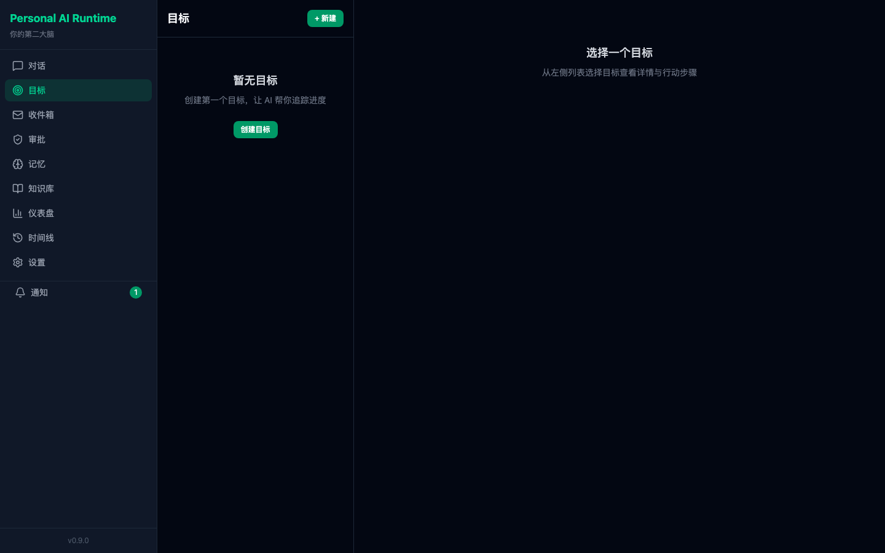

# Personal AI Runtime

> 一个**数据完全属于你**的本地优先 AI 助手。对话、记忆、目标、智能收件箱、工具执行——全部跑在你自己机器上，可一键无损导出，永不被任何厂商锁定。

**它能为你做什么：**

- 💬 **会记事的对话** —— 带长期记忆与目标上下文，不是每次从零开始
- 📥 **智能收件箱** —— 自动轮询、分类、摘要邮件，对话里也能直接查信
- 🎯 **目标与行动管理** —— 停滞检测、主动提醒
- 🛠️ **23 个工具 + 审批治理** —— 写文件、跑命令、发邮件等高风险操作必须经你确认
- 🔒 **数据主权护城河** —— 完整 `event_log` 无损导出/导入，跨模型可重建你的全部个人数据

**为什么不同：** 大多数 AI 助手把你的数据存在它们的云上。这个项目反过来——Kernel 边界保证 Agent 永远不能直接读写你的存储，所有改动都留痕在不可变的事件日志里，你随时可以带着数据走。

## 截图

| 对话 + 审批治理 | 目标管理 | 数据主权导出 |
|:---:|:---:|:---:|
|  |  |  |

**本地快速预览：** 配置 `.env` 后 `make dev`，另开终端执行 `make demo` 写入示例目标 / 记忆 / 对话（可重复执行，已存在则跳过）。

截图由 `docs/assets/mock/` 下的静态页面生成，更新 UI 后可运行 `make screenshots` 重新导出 PNG。

## 环境要求

- Python 3.12+
- Node.js 20+
- （可选）Ollama — 本地记忆抽取与敏感操作路由
- （可选）Gmail 应用专用密码 — 智能收件箱（IMAP 读信 / SMTP 发信）
- （可选）Docker & Docker Compose — 容器化启动

## 快速开始

### 1. 配置环境变量

```bash
cp .env.example .env
# 编辑 .env，至少设置 LLM_API_KEY（DeepSeek 等 OpenAI 兼容 API）
# 使用收件箱功能时，另配 EMAIL_USER / EMAIL_PASS（Gmail 应用专用密码）
```

完整变量说明见 [.env.example](.env.example)。

### 2. 方式 A：Makefile（推荐日常开发）

```bash
make install   # 安装 backend + frontend 依赖
make dev       # 并行启动后端 (8000) 与前端 (5173)
make demo      # （另开终端）写入示例目标 / 记忆 / 对话
```

浏览器打开 http://localhost:5173

### 3. 方式 B：Docker Compose

```bash
docker compose up --build
```

- 前端：http://localhost:5173
- 后端 API：http://localhost:8000
- API 文档：http://localhost:8000/docs
- 容器内后端绑定 `0.0.0.0`；若端口映射到局域网，请在 `.env` 中设置 `AUTH_TOKEN`

### 4. 桌面端（可选）

```bash
make desktop
# 或
cd desktop && npm install && npm start
```

Electron 壳会通过 WebSocket (`ws://localhost:8000/ws`) 接收桌面通知。启用 `AUTH_TOKEN` 时，Desktop 会读取同名的 `AUTH_TOKEN` 环境变量并以 `auth.<token>` 子协议连接。

## 手动启动

```bash
# 后端 — 必须在 backend/ 目录下运行
cd backend
python3 -m uvicorn app.main:app --reload --port 8000

# 前端（新终端）
cd frontend
npm run dev
```

### Windows（PowerShell）

`make dev` 依赖 bash 语法，在 PowerShell 中请分两个终端手动启动：

```powershell
# 终端 1 — 后端
cd backend
python -m uvicorn app.main:app --reload --port 8000

# 终端 2 — 前端
cd frontend
npm run dev
```

可选：安装 [Git Bash](https://git-scm.com/) 或 WSL 后可直接使用 `make install` / `make dev`。

## 环境变量（常用）

| 变量 | 说明 | 默认值 |
|------|------|--------|
| `LLM_API_KEY` | 主 LLM API Key（必填） | — |
| `LLM_BASE_URL` | API 地址 | `https://api.deepseek.com/v1` |
| `LLM_MODEL` | 模型名 | `deepseek-chat` |
| `MAX_TOOL_ITERATIONS` | 单条消息内工具调用轮次上限 | `10` |
| `EMAIL_USER` / `EMAIL_PASS` | Gmail 收件箱（应用专用密码） | — |
| `OLLAMA_BASE_URL` | 本地 Ollama（记忆抽取） | `http://localhost:11434/v1` |
| `MEMORY_EXTRACTOR` | 记忆抽取后端：`ollama` 或 `cloud` | `ollama` |
| `HOST` | 后端监听地址 | `127.0.0.1` |
| `CORS_ORIGINS` | 允许的前端源 | `http://localhost:5173,http://localhost:5174` |
| `AUTH_TOKEN` | API Bearer 认证（可选，留空则关闭） | — |
| `VITE_AUTH_TOKEN` | 前端 Bearer token（启用认证时需与 `AUTH_TOKEN` 一致） | — |

其余变量见 [.env.example](.env.example)。

### API 认证（可选）

默认绑定 `127.0.0.1` 且不启用认证（仅本机可访问）。若需绑定 `0.0.0.0` 或在局域网暴露，**必须**在 `.env` 中设置：

```bash
AUTH_TOKEN=your-secret-token
VITE_AUTH_TOKEN=your-secret-token   # 必须与 AUTH_TOKEN 一致
```

- 根目录 `.env` 同时供后端与前端（Vite `envDir` 指向仓库根目录）使用
- HTTP 请求：前端自动附加 `Authorization: Bearer <token>`
- WebSocket 通知：通过 `Sec-WebSocket-Protocol: auth.<token>` 传递（不出现在 URL 中）
- 未设置 `AUTH_TOKEN` 时，后端与测试均不受影响

## 常用命令

```bash
make test              # backend pytest + frontend tsc + vitest
make ci-local          # 接近 CI 的本地回归（含 boundary + export roundtrip）
make test-backend      # 仅后端测试
make test-frontend     # 仅前端类型检查
make boundary          # Kernel 边界守卫（与 CI 一致）
make boundary-inventory # 全仓 bypass 清单
make boundary-strict   # 零债务模式（allowlist 非空时失败）
make rebuild-verify          # Event Log 重建验证
make export-roundtrip-verify # 无损导出/导入往返验证
make snapshot-verify         # 投影快照增量 rebuild 验证
```

CI 还额外运行 ruff、mypy、schema 校验、MCP 工具注册校验等，见 [.github/workflows/ci.yml](.github/workflows/ci.yml)。

## 功能概览

| 页面 | 能力 |
|------|------|
| Chat | 带记忆/目标上下文的对话，23 个 MCP 工具，高风险操作审批 |
| Inbox | 邮件轮询、分类、摘要；对话中也可 `check_inbox` 查信 |
| Goals | 目标与行动管理，停滞检测 |
| Dashboard | 系统状态与主动建议 |
| Timeline | 活动与事件时间线 |

**后端 API（无独立前端页）：** Knowledge（文档导入与 RAG）、Telemetry、Triggers 等 — 见 `/docs`。

**后台服务（启动时自动运行）：** Pattern Aggregator（活动模式检测）、Belief Engine（定时反思）、Inbox 轮询（每 15 分钟）。

## 测试审批流程

1. 在对话中让 AI 执行写文件等高风险操作（如「在桌面创建一个 test.txt」）
2. 前端弹出确认对话框
3. 点击「批准」后工具执行；点击「拒绝」则 AI 收到拒绝反馈

## 数据主权

```bash
# 导出全部个人数据（需确认码）
curl -X POST http://localhost:8000/api/system/export \
  -H "Content-Type: application/json" \
  -d '{"confirm":"EXPORT_ALL_DATA"}' \
  -o backup.json

# 导入校验（只读，不写入）
curl -X POST http://localhost:8000/api/system/import \
  -H "Content-Type: application/json" \
  -d '{"read_only":true,"data":{...}}'

# 破坏性导入（需确认码 + read_only=false）
curl -X POST http://localhost:8000/api/system/import \
  -H "Content-Type: application/json" \
  -d '{"read_only":false,"confirm":"DESTROY_AND_IMPORT","data":{...}}'
```

## 常见问题

**`ModuleNotFoundError: No module named 'app'`**  
必须在 `backend/` 目录下启动 uvicorn，不要在 `backend/backend/` 或其他路径。

**前端连不上后端 / CORS 错误**  
若 Vite 使用了 5174 端口，确保 `.env` 中 `CORS_ORIGINS` 包含 `http://localhost:5174`。

**对话一直「思考中」**  
检查 `LLM_API_KEY` 是否有效，查看后端终端错误日志。

**查邮件缺了已读邮件**  
对话工具 `check_inbox` 默认返回最近邮件（含已读）；后台 Inbox 轮询仅抓未读新邮件。

**ChromaDB 首次启动慢 / 日志里 embedding ID 警告**  
首次运行会下载 embedding 模型；Chroma 的 `Add/Delete of existing/nonexisting embedding ID` 为内部 WAL 警告，一般可忽略。

## 架构

```
User → Runtime Kernel (Event Log / State / Permissions)
         ├─ Agents (Brain, Planner, Critic — ephemeral)
         ├─ Capabilities (23 MCP Tools)
         ├─ Apps (Inbox, Brief, Review, …)
         └─ Storage (SQLite + ChromaDB, 本地)
```

架构契约（Runtime Primitive / Kernel Boundary / ABI）详见 [RUNTIME_SPEC.md](docs/RUNTIME_SPEC.md)，安全边界见 [THREAT_MODEL.md](docs/THREAT_MODEL.md)。完整文档索引见 [docs/README.md](docs/README.md)。

## 版本

当前版本：**0.9.0**（backend / frontend / desktop 统一）
