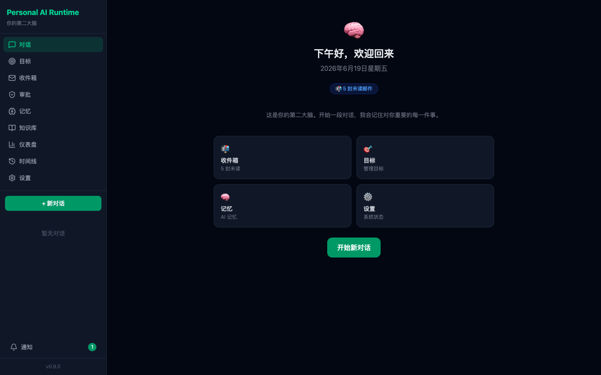
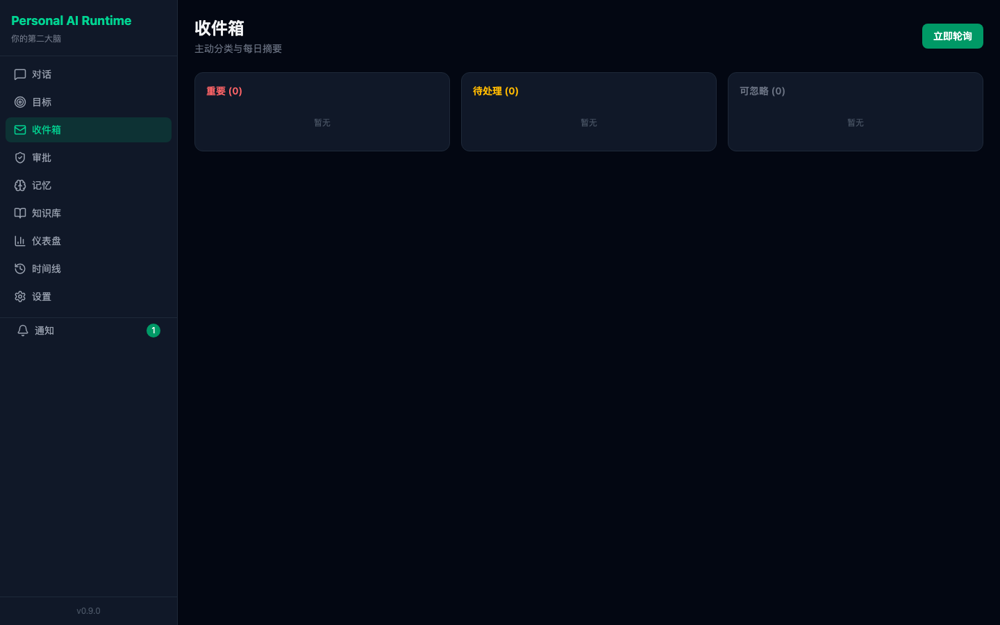
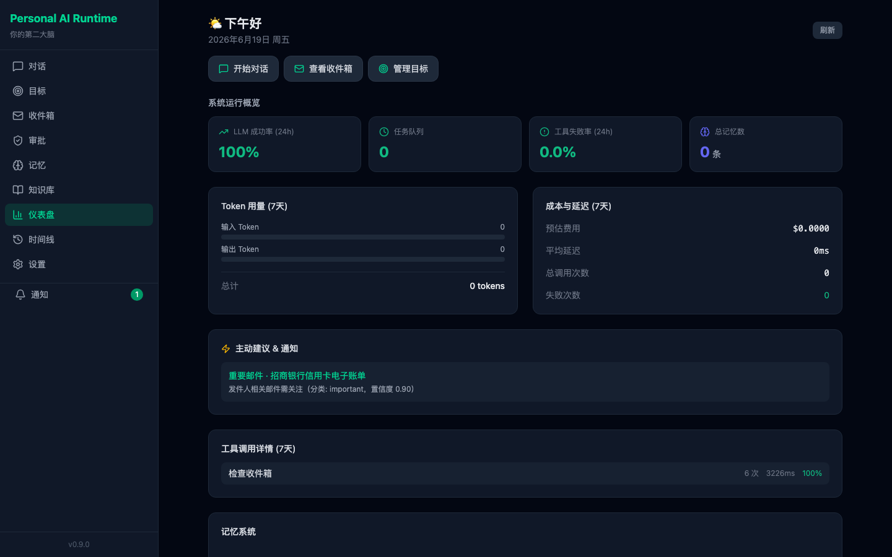
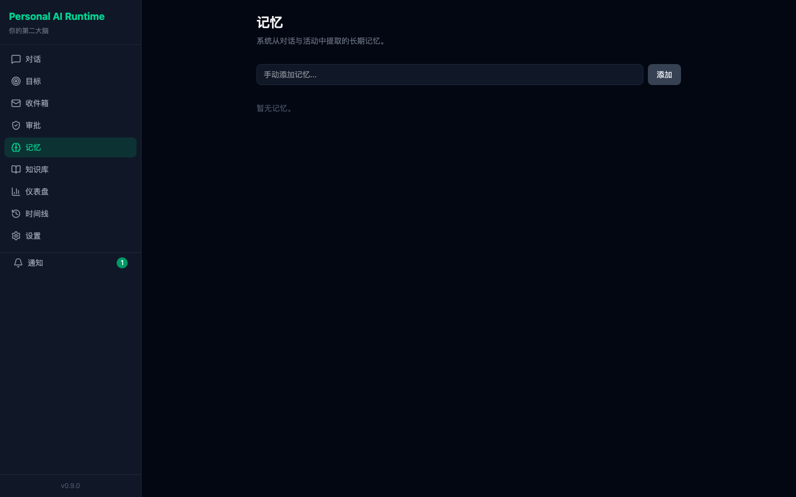

# Personal AI Runtime

> **你的个人 AI。换模型不丢自己。**

你的 AI 应该属于你——不是 OpenAI 的，不是 Apple 的，不是 Google 的。你的。

无论你换多少次模型、换多少家厂商，你的 AI 永远记得你、理解你、并尊重你的意志。

**English:** [README.en.md](README.en.md)

---

## 它能做什么

| 对话 | 目标 | 收件箱 |
|:---:|:---:|:---:|
|  |  |  |

| 仪表盘 | 记忆 |
|:---:|:---:|
|  |  |

- **Chat** — 带记忆和目标上下文的对话。AI 知道你是谁、在做什么、喜欢什么。
- **Inbox** — 邮件轮询、分类、摘要。在对话中直接让 AI 帮你处理邮件。
- **Goals** — 目标和行动管理。停滞检测，主动提醒。
- **Memories** — 长期记忆浏览、搜索、编辑。AI 对你的理解会随时间增长。
- **Dashboard** — 系统状态概览。AI 使用统计、成本趋势。
- **Approvals** — 高风险操作（写文件、发邮件、执行命令）需要你批准。AI 不能背着你干坏事。

---

## 快速开始

```bash
# 1. 克隆
git clone https://github.com/yyyyyyyy/personal-ai-runtime.git
cd personal-ai-runtime

# 2. 配置 LLM
cp .env.example .env
# 编辑 .env，填写 LLM_API_KEY（推荐 DeepSeek，注册即送额度）

# 3. 安装并启动
make install && make dev

# 4. 打开浏览器
# http://localhost:5173
```

Docker 用户：

```bash
docker compose up --build
```

完整变量说明见 [.env.example](.env.example)。更多启动方式见 [使用手册](docs/guides/USER_GUIDE.md)。

---

## 长期记忆

- 每一条记忆都标注了来源（哪次对话），可见、可编辑、可追溯
- 换模型只需改一行配置，记忆完全保留
- 数据存储在你的机器上，一键完整导出 JSON

---

## 核心理念

如果你的 AI 不认识你，它只是一个工具。

如果它认识你——但只在某个模型、某个厂商那里——你不拥有那段关系。

这个项目的目标是：**让你永远不需要在新 AI 面前从零开始。**

无论换多少次模型，你的 AI 都记得你。

技术上，这通过 Event Sourcing 实现：你与 AI 的一切互动以不可变事件流记录，记忆和状态从事件流推导出来，可随时完整导出和重建。

---

## 环境要求

- Python 3.12+
- Node.js 20+
- （可选）Ollama — 本地记忆抽取与敏感操作路由
- （可选）Gmail 应用专用密码 — 智能收件箱
- （可选）Docker — 容器化启动

---

## 环境变量（常用）

| 变量 | 说明 | 默认值 |
|------|------|--------|
| `LLM_API_KEY` | 主 LLM API Key（必填） | — |
| `LLM_BASE_URL` | API 地址 | `https://api.deepseek.com/v1` |
| `LLM_MODEL` | 模型名 | `deepseek-chat` |
| `MAX_TOOL_ITERATIONS` | 单条消息内工具调用轮次上限 | `10` |
| `EMAIL_USER` / `EMAIL_PASS` | Gmail 收件箱（应用专用密码） | — |
| `OLLAMA_BASE_URL` | 本地 Ollama（记忆抽取） | `http://localhost:11434/v1` |
| `MEMORY_EXTRACTOR` | 记忆抽取后端：`ollama` 或 `cloud` | `ollama` |
| `HOST` | 后端监听地址 | `127.0.0.1` |
| `CORS_ORIGINS` | 允许的前端源 | `http://localhost:5173,http://localhost:5174` |
| `AUTH_TOKEN` | API Bearer 认证（可选） | — |
| `MCP_EXTERNAL_ENABLED` | 是否加载外部 MCP 工具 | `true` |
| `BUILTIN_TOOL_CATEGORIES` | 启用的内置工具类别（留空=核心 10 类；加 `computer_use,voice,clipboard_ocr` 启用高级工具） | 空（仅核心） |

其余变量见 [.env.example](.env.example)。

---

## 安全须知

- **默认绑定 127.0.0.1，无认证**。本项目设计为本地单用户运行。
- **绝不要直接部署到公网**。内置 `shell_exec`、`write_file`、`send_email` 等高风险工具。若需暴露到局域网或绑定 `0.0.0.0`，必须在 `.env` 中设置 `AUTH_TOKEN` 和 `VITE_AUTH_TOKEN`（两者须一致，详见 [CONFIGURATION](docs/reference/CONFIGURATION.md)）。
- **高风险操作需要你审批**。写文件、发邮件、执行命令等操作会弹出确认框。
- **污点追踪**。从外部摄入的内容（邮件、网页抓取）可能触发风险升级，防止被钓鱼邮件诱导执行危险操作。

详见安全模型：

| 能力类别 | 默认风险等级 | 缓解机制 |
|---------|------------|---------|
| 写入类（`write_file`、`apply_patch`） | 需用户审批 | 审批绑定参数且不可重放 |
| 命令执行（`shell_exec`） | 需用户审批 | 命令白名单 + 元字符拒绝 + SSRF 校验 |
| 通讯类（`send_email`、`telegram_send`） | 需用户审批 | 每次调用须审批 |
| 读取类（`read_file`、`search_files`） | 自动放行 | 经 CapabilityGateway 授权 |
| 网络类（`web_search`、`fetch_url`） | 自动放行 | 出站审计 |

---

## 数据主权

你的全部个人数据存储在本机。对话、记忆、目标、决策——全部属于你。

- **Event Log 不可变** — 数据库层拒绝任何 UPDATE/DELETE
- **状态可重建** — 清空投影表后，可从 Event Log 确定性重建（CI 守护字节级一致）
- **数据可导出** — 一键导出完整事件流与关联数据为 JSON

```bash
# 导出全部个人数据（需确认码）
curl -X POST http://localhost:8000/api/system/export \
  -H "Content-Type: application/json" \
  -d '{"confirm":"EXPORT_ALL_DATA"}' \
  -o backup.json
```

---

## 项目状态

当前版本：v0.2.0。Runtime 核心治理完成，核心产品域（对话、记忆、目标、收件箱、审批）已落地。

核心能力已实现并在 CI 中守护：

- **Event Log** — append-only，不可改写
- **Deterministic Rebuild** — 治理投影可确定性重建
- **Approval Governance** — 高风险能力须用户确认
- **Capability Isolation** — CapabilityGateway + 污点追踪 + Fail-Closed 授权

---

## 了解更多

| 你想知道 | 读这篇 |
|---------|--------|
| 为什么是现在做这个？ | [WHY_NOW](docs/product/WHY_NOW.md) |
| 我们相信什么？ | [MANIFESTO](docs/product/MANIFESTO.md) |
| 产品定位与理念 | [POSITIONING](docs/product/POSITIONING.md) |
| 如何使用？ | [USER_GUIDE](docs/guides/USER_GUIDE.md) |
| 技术架构 | [ARCHITECTURE](docs/architecture/ARCHITECTURE.md) |
| 如何贡献？ | [CONTRIBUTING](CONTRIBUTING.md) |
| 开发者指南 | [DEVELOPER_GUIDE](docs/guides/DEVELOPER_GUIDE.md) |
| API 文档 | [API](docs/reference/API.md) + Swagger UI (`/docs`) |
| 未来路线 | [ROADMAP](docs/product/ROADMAP.md) |
| 技术原则与不变量 | [engineering/](docs/engineering/) |

---

## 常见问题

**`ModuleNotFoundError: No module named 'app'`**
必须在 `backend/` 目录下启动 uvicorn。

**前端连不上后端 / CORS 错误**
若 Vite 使用了 5174 端口，确保 `.env` 中 `CORS_ORIGINS` 包含 `http://localhost:5174`。

**对话一直「思考中」**
检查 `LLM_API_KEY` 是否有效。

**ChromaDB 首次启动慢**
首次运行会下载 embedding 模型；Chroma 内部 WAL 警告可忽略。

