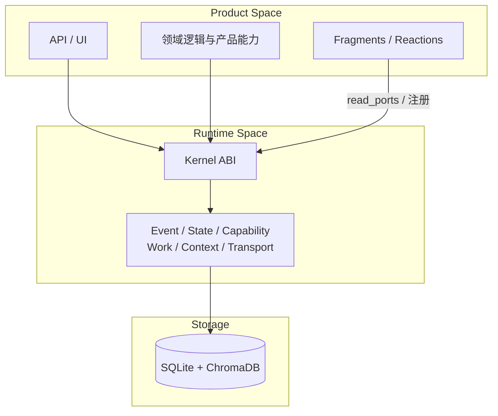
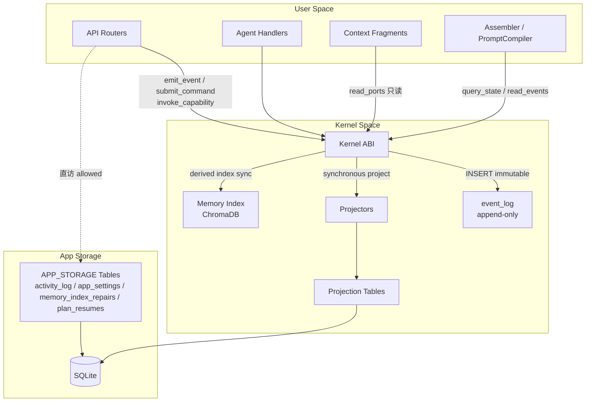
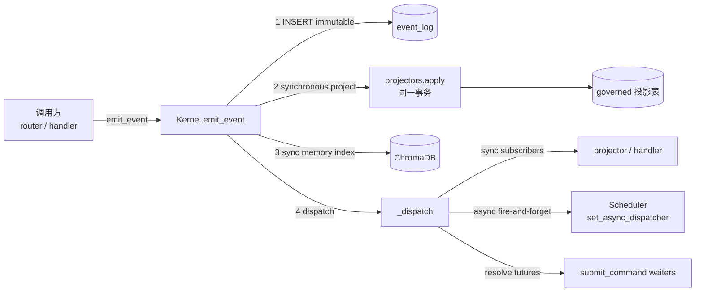
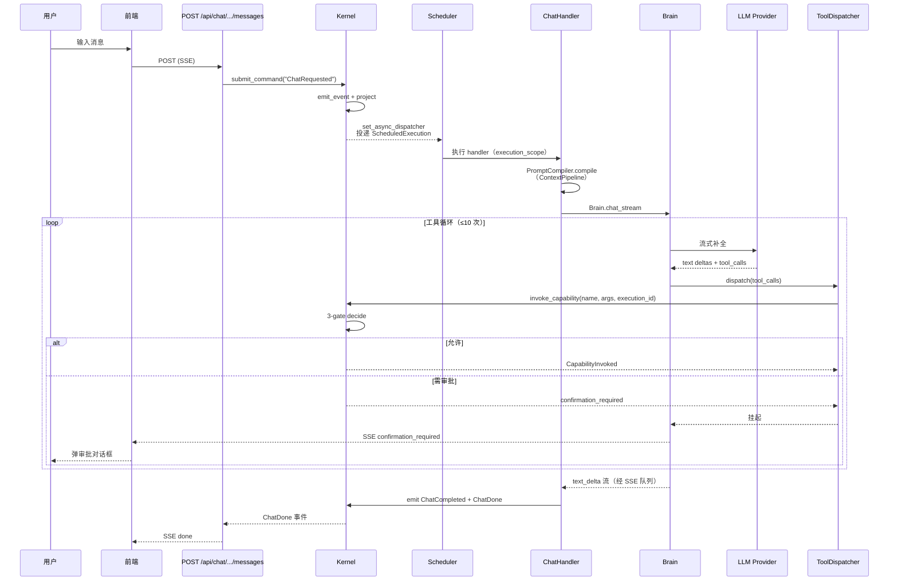

# 架构

本文档描述 Personal AI Runtime 的整体架构与组件交互。核心概念（Runtime Algebra、事件溯源、Kernel 边界、能力治理、上下文管线）在 [02-concepts/](../02-concepts/) 中分章详述，本文只给出整体视图。

## 职责视图：Runtime 与 Product

系统按职责划分为 Runtime（机制）与 Product（领域策略）。Runtime 通过六原语组合扩展；Product 通过 Kernel ABI 使用原语。详见 [architecture-principles.md](../02-concepts/architecture-principles.md) 与 [runtime-algebra.md](../02-concepts/runtime-algebra.md)。

## 权限视图：三层架构

系统在存储与写入权限上划分为清晰的层次。下表对应 [`backend/app/store/table_registry.py`](../../backend/app/store/table_registry.py) 的表分类与 [`backend/scripts/check_boundary.py`](../../backend/scripts/check_boundary.py) 强制的代码边界。

| 层 | 职责 | 谁能写入 | 对应代码 |
|---|---|---|---|
| **User Space**（用户空间） | API router、前端、agent handlers、fragments、Product 模块 | 只能通过 Kernel ABI 读写 governed 数据 | `backend/app/api/`、`backend/app/product/`、`backend/app/fragments/`、`backend/app/core/agents/` |
| **Kernel Space**（内核空间） | 唯一写入 `event_log` 与 governed 投影表的实体；管理 ChromaDB 索引 | Kernel 自身 | `backend/app/core/runtime/kernel/` |
| **App Storage**（应用存储） | 可观测性、缓存、本地配置 | 任意模块直访 SQLite | `backend/app/store/database.py`（针对 `APP_STORAGE_TABLES`） |

**GOLDEN RULE**：User Space 永远不直访 `event_log` 或 governed 投影表。唯一的写入入口是 `kernel.emit_event()` / `kernel.submit_command()` / `kernel.invoke_capability()`。这条规则由 [`backend/scripts/check_boundary.py`](../../backend/scripts/check_boundary.py) 在 CI 中静态扫描强制。

## 事件溯源核心流

所有业务状态变更走同一条管道（详见 [02-concepts/event-sourcing.md](../02-concepts/event-sourcing.md)）：

关键点：投影在 `emit_event` 的**同一 SQLite 事务**内同步完成（[`backend/app/core/runtime/kernel/kernel.py`](../../backend/app/core/runtime/kernel/kernel.py) 的 `Kernel.emit_event`），因此投影状态始终与其触发事件一致。ChromaDB 索引在事件**事务提交后**维护（post-commit），保证 event_log 写入失败时不会产生孤儿向量；索引成功后 backfill `embedding_id`，失败会被持久化到 `memory_index_repairs` 表（APP_STORAGE），由 [`backend/app/core/runtime/runtime_loop.py`](../../backend/app/core/runtime/runtime_loop.py) 的 `_drain_memory_index_repairs` worker 每 ~10s 重试（上限 5 次）。重试耗尽的行标记为 `failed_permanent` 并发 `MemoryIndexRepairFailed` 事件供前端可见。CI 通过 [`scripts/verify_vector_consistency.py`](../../backend/scripts/verify_vector_consistency.py) 与 [`scripts/verify_memory_index_repairs.py`](../../backend/scripts/verify_memory_index_repairs.py) 对账。

## 一次聊天回合的执行流

这是系统中最重要的端到端数据流，串联了几乎所有子系统：

详细说明见 [03-subsystems/backend-core.md](../03-subsystems/backend-core.md)。

## 子系统边界

| 子系统 | 边界由谁强制 | 强制方式 |
|---|---|---|
| Kernel 写入独占 | `check_boundary.py` | 静态正则扫描 User Space 的 DML/SELECT/import 违规 |
| 层依赖（职责边） | `check_layer_deps.py` | Runtime↛Product、Store↛Runtime、API/Product 深模块与私有 import |
| 执行归属 | `check_execution_ownership.py` | 静态扫描所有 `invoke_capability(` 调用必须含 `execution_id` |
| 投影溯源 | `check_projection_provenance.py` | 运行时 SQL join 验证每条投影行有对应 `event_log` 事件 |
| 事件日志可重建 | `verify_rebuild.py` 等 12 个脚本 | 重放 `event_log` 重建全部投影并与原状态字节比对 |
| LLM 出口审计 | `verify_egress.py` | 验证 `audit_llm_egress` 发出 `EgressAudited` 事件 |
| 向量一致性 | `verify_vector_consistency.py` | SQLite 记忆集合与 ChromaDB collection 集合对账 |
| 收件箱双写一致性 | `verify_inbox_audit.py` | 验证 `inbox_emails` 表与 `InboxEmailRecorded` 事件 1:1 对应 |
| Schema 完整性 | `verify_alembic.py` + 测试 | 19 张必需表存在 + PRAGMA 校验 |

这些不变量是文档后续章节的基础，详见 [05-engineering/testing.md](../05-engineering/testing.md)。

## 关键设计决策（从代码可见）

1. **Transport ≠ Event**：聊天文本增量（`text_delta`）经 TRANSPORT（[`notification_bridge.py`](../../backend/app/core/runtime/notification_bridge.py) 的内存队列 / SSE / WS）推送，不入 `event_log`。`ChatCompleted`/`ChatDone` 等完成态事实才持久化。见 [runtime-algebra.md §1.6](../02-concepts/runtime-algebra.md)。
2. **统一 RuntimeLoop**：[`runtime_loop.py`](../../backend/app/core/runtime/runtime_loop.py) 用 100ms 单循环驱动 timer 扫描与维护（审批过期、索引修复、reaction 评估、后台任务派发）。阻塞型维护经 `asyncio.to_thread` 卸载，避免卡住 event loop。
3. **execution_scope ContextVar**：所有 capability 调用必须绑定 `execution_id`（[`execution.py`](../../backend/app/core/runtime/execution.py)），用于归属与崩溃恢复。
4. **调度 Work 崩溃恢复**：Scheduler 扫描中断的 `handler_executions`，重放为 `ExecutionRetried(reason=interrupted)`。
5. **投影快照增量重建**：`kernel.rebuild(aggregate_type)` 从 `projection_checkpoints.last_applied_seq` 增量重放（[`verify_snapshot_rebuild.py`](../../backend/scripts/verify_snapshot_rebuild.py)）。

## 下一步

- 原语与概念纪律：[runtime-algebra.md](../02-concepts/runtime-algebra.md)
- 原则与 Forbidden：[architecture-principles.md](../02-concepts/architecture-principles.md)
- 不变量清单：[runtime-invariants.md](../02-concepts/runtime-invariants.md)
