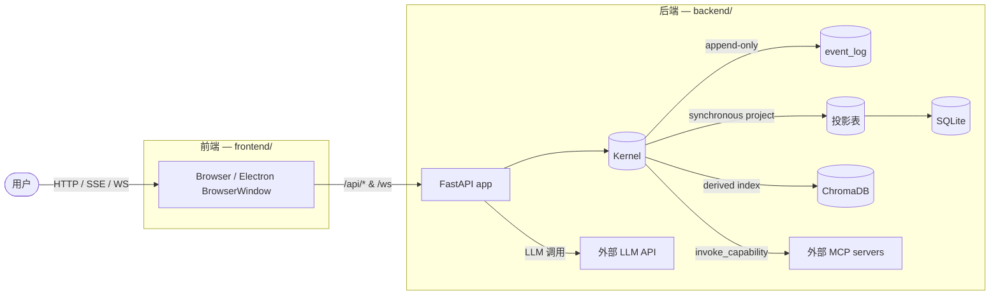

# 项目概览

## 是什么

Personal AI Runtime 是一个**本地优先、单用户、事件溯源**的个人 AI 运行时。当前版本 `0.2.0`（[`backend/app/version.py`](../../backend/app/version.py)）。

它由三个子系统构成，全部源码位于本仓库：

| 子系统 | 目录 | 技术栈 | 入口 |
|---|---|---|---|
| 后端 | [`backend/`](../../backend/) | Python 3.12 · FastAPI · SQLite(WAL) · ChromaDB | `app.main:app` |
| 前端 | [`frontend/`](../../frontend/) | React 19 · Vite · TanStack Query · Zustand · Tailwind v4 | `src/main.tsx` |
| 桌面端 | [`desktop/`](../../desktop/) | Electron 43 | `main.js` |

后端是核心：所有个人数据（目标、记忆、对话、收件箱、审批、知识库）都存储在本机 SQLite 与 ChromaDB 中，由一个**事件溯源内核（Kernel）**统一写入。前端是 SPA，通过 HTTP `/api/*` 与 SSE/WebSocket 与后端通信。桌面端是 Electron 包装，负责 spawn 后端进程、加载前端、提供托盘与全局快捷键。

## 为什么

后端代码与配置中可观察到的设计意图：

- **数据主权**：个人数据全部本地存储，可整包加密导出/导入/销毁（[`backend/app/product/digital_legacy.py`](../../backend/app/product/digital_legacy.py)、[`backend/app/product/encrypted_sync.py`](../../backend/app/product/encrypted_sync.py)）。系统 `/api/system/export`、`/api/system/export/encrypted`、`/api/system/import`、`DELETE /api/system/data` 构成完整的数据进出闭环。
- **可审计**：所有业务状态变更作为不可变事件追加到 `event_log` 表（[`backend/app/store/schema_ddl.py`](../../backend/app/store/schema_ddl.py) 中的 append-only 触发器 `event_log_no_update`/`event_log_no_delete`），可随时重建任何投影表。
- **可控的能力执行**：LLM 调用工具必须通过 4-gate 治理（[`backend/app/core/runtime/capability_governance.py`](../../backend/app/core/runtime/capability_governance.py)），写类工具需用户审批，外部内容（邮件、网页）进入上下文会被 taint 标记。
- **可观测的 LLM 出口**：每次 LLM 调用前经 `prepare_llm_egress` 审计分类（[`backend/app/core/runtime/egress/egress_gate.py`](../../backend/app/core/runtime/egress/egress_gate.py)）。

> 文档仅陈述代码可验证的事实。本节描述的是代码中可观察到的设计意图，而非作者声明。

## 整体形态



## 顶层目录布局

```
personal-ai-runtime/
├── backend/        # Python 后端（FastAPI + Kernel + 工具）
├── frontend/       # React SPA
├── desktop/        # Electron 桌面包装
├── scripts/        # 根级运维脚本（git hook 安装、soak 测试、健康等待）
├── .githooks/      # Conventional Commits 与 ruff/mypy 预提交钩子
├── .github/        # CI / 发布 / Dependabot 工作流
├── Makefile        # Unix 任务编排（开发、测试、验证、Docker）
├── Makefile.ps1    # Windows PowerShell 等价
├── install.sh      # 交互式安装向导
├── docker-compose.yml
├── .env.example    # 配置模板
└── .gitleaks.toml  # 密钥扫描规则
```

后端内部的关键子目录在 [architecture.md](architecture.md) 中详述。

## 当前状态标记

代码中可观察到的、文档需明确标注的现状：

- `backend/app/api/workflows.py` 定义了完整 router，但 [`backend/app/main.py`](../../backend/app/main.py) **未通过 `include_router` 挂载**。前端 `WorkflowList.tsx`、`WorkflowEditor.tsx`、`SceneTemplates.tsx`、`IntegrationsHub.tsx` 同样未进入 [`frontend/src/router.tsx`](../../frontend/src/router.tsx)。这些端点与页面在当前运行实例中不可达。
- `apscheduler==3.11.0` 仍在 [`backend/requirements.txt`](../../backend/requirements.txt) 与 [`backend/pyproject.toml`](../../backend/pyproject.toml) 中，但 [`backend/app/core/runtime/cron_registry.py`](../../backend/app/core/runtime/cron_registry.py) 注释声明 v0.3.0 起定时器扫描已迁移到 `runtime_loop`。代码库中证据不足：未在 `backend/app/core/` 中观察到对 APScheduler 的实际导入。
- `desktop/preload.js` 通过 `contextBridge.exposeInMainWorld('electronAPI', ...)` 暴露了 `getBackendUrl`、`sendNotification`、`platform`，但在 `frontend/src/` 中未观察到任何对这些绑定的消费代码。代码库中证据不足：当前前端不使用这些 IPC 绑定。
- `backend/app/version.py` 标注 `VERSION = "0.2.0"`，但其他模块 docstring 中出现 `v0.3.0`/`v0.4.0`/`v0.5.0` 等子系统版本号；这些是子系统演进标记，与项目整体版本不同步。

## 下一步

阅读 [architecture.md](architecture.md) 了解整体架构与组件关系。
