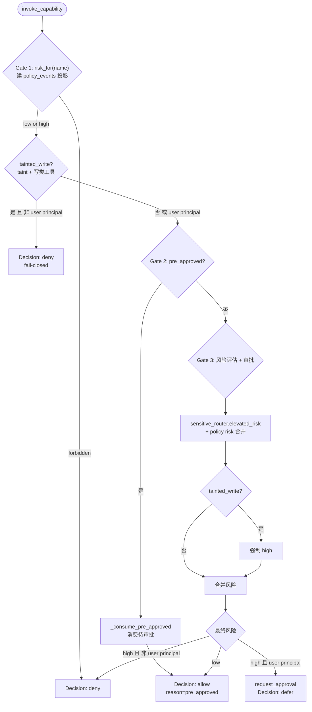

# 能力治理

本文档解释 Personal AI Runtime 的能力治理模型——LLM 调用任何工具前必须通过的 3-gate 授权、防提示注入的 taint 追踪、身份解析与执行归属。

`agent:*` actor 统一解析为 system principal（Scheduler 内部信任代码）。

## 入口：`Kernel.invoke_capability`

所有工具调用（内建工具与外部 MCP 工具）的唯一入口是 `Kernel.invoke_capability()`（[`backend/app/core/runtime/kernel/kernel.py`](../../backend/app/core/runtime/kernel/kernel.py) 的 `Kernel.invoke_capability`）。签名：

```
invoke_capability(name, args, actor, correlation_id,
                  pre_approved=False, approval_id=None,
                  principal=None, execution_id=None)
```

执行步骤：

1. 解析 Principal（`identity_resolver.resolve(actor)`）。
2. 执行归属校验：`agent:*` / `scheduler` / `executor` / `background` 类 actor 必须绑定 `execution_id`，否则拒绝（见下文）。
3. 调用 `capability_governance.decide(...)` 走 3-gate。
4. 根据 decision 发出 `CapabilityDenied` / `CapabilityDeferred` / `CapabilityInvoked` / `CapabilityFailed` 事件。
5. 若工具属外部摄入类，成功后 `taint_registry.mark(correlation_id)`。

## 3-Gate 授权

`CapabilityGovernance.decide()`（[`backend/app/core/runtime/capability_governance.py`](../../backend/app/core/runtime/capability_governance.py) 的 `CapabilityGovernance.decide`）依次执行：



返回 `CapabilityDecision(decision ∈ {allow, deny, defer}, reason, approval_id)`。

## 风险查询：`risk_for`

`CapabilityGovernance.risk_for(name, kernel, mcp_default_high)` 返回 `"forbidden" | "high" | "low"`。来源：

1. **静态策略种子** — [`backend/capability_policy.json`](../../backend/capability_policy.json) 在启动时由 `capability_governance.seed_from_json(kernel)` 注入为 `PolicyCreated` 事件（[`main.py`](../../backend/app/main.py)）。该 JSON 仅是种子，投影表 `policy_events` 才是权威。

   当前策略：
   - **auto_allow**（只读/搜索/观察工具）：`read_file`、`web_search`、`list_calendar_events`、`check_inbox`、`git_status`/`log`/`diff`、`computer_screen_size`、`voice_tts`/`stt` 等。
   - **needs_user**（变更工具，需审批）：`apply_patch`、`write_file`、`add_calendar_event`、`send_email`、`shell_exec`、`telegram_send`、全部 `computer_*` 控制类工具（click/type/move/scroll/key/screenshot）。
   - **forbidden**：空。

   > **权威性**：`policy_events` 是 3-gate 治理查询的唯一事实来源；`ToolDef.requires_confirmation`（[`mcp_hub.py`](../../backend/app/core/harness/mcp_hub.py)）仅是缺少策略行时的兜底默认。两者一致性由 [`scripts/check_capability_policy_consistency.py`](../../backend/scripts/check_capability_policy_consistency.py) 在 CI 中强制。

2. **外部 MCP 工具** — `register_external_tool(name, risk)` 在工具发现时发出 `PolicyCreated`/`Updated`；`clear_external_tools()` 发出 `PolicyRevoked`。MCP 工具的默认风险由 [`backend/mcp_config.json`](../../backend/mcp_config.json) 的 `policy_default` 字段决定。

风险查询结果按 `(name, mcp_default_high)` 缓存，任何策略变更事件失效重算。

## 审批流

- `request_approval`（低风险 → 自动 allow；高风险 → 状态 `pending`，需用户处理）。
- `expire_stale_approvals` — 24h TTL，TOCTOU 安全的原子 UPDATE（[`governance_ops.py`](../../backend/app/core/runtime/kernel/governance_ops.py)）。RuntimeLoop 每 100 tick（~10s）调用一次。
- `grant_approval` / `deny_approval` — 用户在 UI 或 `/api/approvals/{id}/approve|reject` 处理。

审批通过后，工具调用经 `submit_command("ApproveRequested")` 走 Kernel ABI 重新执行；可选地通过 `Brain.continue_after_tool_result`（递归深度上限 3）做 **one-shot 文本续写**（不传 tools，不重开完整工具环）。该续写坐标**不跨进程持久化**：服务重启后需用户新开回合。产品契约见 [ADR-R011](../07-adr/ADR-R011-chat-approval-continuation.md) 与 [execution-model.md](execution-model.md) 控制面表。审批 HTTP 端点见 [03-subsystems/backend-api.md](../03-subsystems/backend-api.md)。

## Taint 追踪（防提示注入）

[`backend/app/core/runtime/taint.py`](../../backend/app/core/runtime/taint.py) 跟踪不可信内容的污染。当外部内容（收件箱、网页抓取）进入 agent 上下文后，同一 `correlation_id` 链上的后续写类工具调用必须强制 high 风险。

关键实现：

- `TaintRegistry`（[`taint.py`](../../backend/app/core/runtime/taint.py)）按 `correlation_id` 维护污染标记，**实例级 dict**（非 ContextVar，避免 `asyncio.gather` 扇出 bug），TTL 300s。
- 工具分类集合：
  - `_BUILTIN_EXTERNAL_INGESTION_TOOLS`（[`taint.py`](../../backend/app/core/runtime/taint.py)）：`check_inbox`、`read_inbox_email`、`web_search`、`fetch_url`（另含外部 MCP ingestion 工具）。
  - `WRITE_CLASS_TOOLS`（[`taint.py`](../../backend/app/core/runtime/taint.py)）：`apply_patch`、`write_file`、`add_calendar_event`、`send_email`、`shell_exec`、`telegram_send`、`computer_click`/`type`/`key`。
- 集成点：`Kernel.invoke_capability` 在摄入类工具成功后调用 `taint_registry.mark(correlation_id, source="external_ingestion", reason=name)`（[`kernel.py`](../../backend/app/core/runtime/kernel/kernel.py)）。
- Brain 在每次回合开始时清空该 `correlation_id` 的 taint。

`is_external_ingestion_tool` / `is_write_class_tool` / `register_external_ingestion_tool` / `register_external_write_tool` / `reset_external_tools` 是公开接口。

## 敏感操作路由

[`backend/app/core/runtime/capability_governance.py`](../../backend/app/core/runtime/capability_governance.py) 末尾的 `SensitiveRouter` 用启发式判定敏感操作：写工具永远敏感；正则匹配 password/api_key/secret/token、`.pem`/`.key`/`.env` 文件、家目录路径。`sensitive_router.elevated_risk(name, args)` 返回 `"high"` 或空（由原 `sensitive_router.py` 折叠而来）。

## 身份与执行归属

### Principal

[`backend/app/core/runtime/execution.py`](../../backend/app/core/runtime/execution.py) 定义类型化运行时身份（Execution 契约 §8）：

```
Principal(principal_id, type ∈ {system, user}, actor, allowed_capabilities)
```

冻结 dataclass。`IdentityResolver.resolve(actor, kernel)` 把 actor 映射到 Principal：

- `system` / `kernel` / `scheduler` / `executor` / `background` / `agent:*`（Scheduler actor） → `Principal.system()`
- 其他任意 actor（含 `user`、用户名） → `Principal.user(actor)`

只有 `system` 与 `user` 两种 principal 类型——Scheduler 是受信任的 Runtime 代码，所有内部 actor 统一以 system 身份运行。

### execution_scope

[`backend/app/core/runtime/execution.py`](../../backend/app/core/runtime/execution.py) 提供 `execution_scope(execution_id)` 上下文管理器，通过 ContextVar 绑定当前执行 id。`actor_requires_execution_ownership()` 对 `agent:*`、`scheduler`、`executor`、`background` 返回 True。`Kernel.invoke_capability` 在此类 actor 未绑定 `execution_id` 时直接拒绝——保证所有工具调用可归属到一条 `handler_executions` 记录，用于崩溃恢复与审计。

## 治理事件溯源

治理本身是事件溯源的根：

- `policy_events` 表 — 每个能力的风险等级与状态，由 [`projectors_governance.py`](../../backend/app/core/runtime/kernel/projectors_governance.py) 从 `PolicyCreated/Updated/Revoked` 事件投影。`risk_for` 读取此投影（带缓存）。

## 出口审计

LLM 调用前的审计边界由 [`backend/app/core/runtime/egress/egress_gate.py`](../../backend/app/core/runtime/egress/egress_gate.py) 实现。`audit_llm_egress(messages, purpose, actor)` 返回 `(messages, audit_meta)`——**messages 原样通过，不做脱敏**——同时发出 `EgressAudited` 事件，分类为 `identity_surface` / `memory_context` / `trajectory_context` / `general`。Brain 与 BrainCompletionMixin 在每次 LLM 调用前调用。

验证：[`scripts/verify_egress.py`](../../backend/scripts/verify_egress.py)。详见 [05-engineering/security.md](../05-engineering/security.md)。
