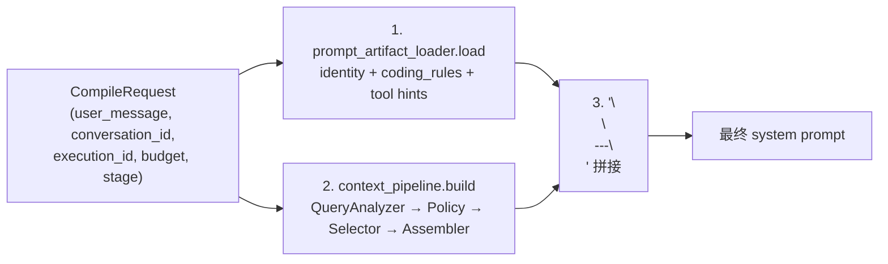

# 上下文管线

本文档解释 Personal AI Runtime 如何把用户消息编译为 LLM 系统提示——从 Context Fragment 选择、预算分配到最终拼装。

## 总览

每次 LLM 调用前，`PromptCompiler.compile()`（[`backend/app/chat/prompt_compiler.py:43-74`](../../backend/app/chat/prompt_compiler.py)）执行统一的编译流程：

`ChatRequested` handler 与审批续接（`Brain.continue_after_tool_result`）共用这个入口。

## 静态 Prompt Artifact

[`backend/app/chat/prompt_artifact.py`](../../backend/app/chat/prompt_artifact.py) 加载静态身份与编码规则：

- `PROMPTS_DIR = backend/prompts/`，从 `identity.md` 与 `coding_rules.md` 读取；缺失则用 `DEFAULT_IDENTITY` / `DEFAULT_CODING_RULES`。
- `PromptArtifactLoader.load(ctx)`（[`prompt_artifact.py:92-104`](../../backend/app/chat/prompt_artifact.py)）组装：identity + coding_rules（`.format(project_root=BASE_DIR)`）+ `build_prompt_hints(available_tools)`，用 `\n\n` 连接。
- 工具列表来自 `kernel.list_capability_definitions()`。
- v0.1.0 起支持运行时通过 `/api/settings/prompt` 覆盖（存于 `app_settings` 表）。

`identity.md` 与 `coding_rules.md` 的具体内容见 [04-data/configuration.md](../04-data/configuration.md)。

## Context Fragment 原语

[`backend/app/context_runtime.py`](../../backend/app/context_runtime.py) 定义认知原语：

| 类 | 行 | 职责 |
|---|---|---|
| `RuntimeContext` | `15-23` | 传给 fragment 的最小上下文（`user_message`、`conversation_id`、`execution_id`）；**不持有 Kernel 引用** |
| `FragmentResult` | `28-38` | `content`、`token_count`、`sources` |
| `ContextFragment` | `43-69` | 抽象基类；属性 `priority`、`max_tokens`、`tags`、`required_capabilities`；方法 `async collect(ctx) -> FragmentResult` |
| `FragmentRegistry` | `74-98` | `register` / `get` / `list_all` / `by_tag` / `by_tags` |

全局单例 `fragment_registry`（[`context_runtime.py:103`](../../backend/app/context_runtime.py)）。扩展方式：子类化 `ContextFragment`，实现 `collect()`，在 `app/fragments/register.py` 注册。

## 已注册的 Fragment

[`backend/app/fragments/register.py:46-53`](../../backend/app/fragments/register.py) 注册 12 个 fragment，全部为只读 `ContextFragment`，通过 [`read_ports.py`](../../backend/app/core/runtime/read_ports.py) 访问数据。

| Fragment | id | priority | max_tokens | tags | 作用 |
|---|---|---|---|---|---|
| `GovernanceContextFragment` | `core.governance` | 85 | 400 | governance, universal | 运行时治理快照（待审批数、最近工具、停滞目标） |
| `ConversationStateFragment` | `core.conversation_state` | 80 | 800 | conversation, universal | 当前会话状态摘要（最近 6 条） |
| `GoalsContextFragment` | `core.goals` | 75 | 1000 | goals, universal | Top 5 活跃目标 |
| `TimelineContextFragment` | `core.timeline` | 70 | 2000 | timeline, actions, events, universal | 待办 actions + 近 7 天 events |
| `MemoryContextFragment` | `core.memory` | 60 | 2000 | memory, universal | 语义记忆检索（带 sources） |
| `WorldContextFragment` | `core.world` | 55 | 1000 | world, planning, review | 30 天生活快照 |
| `KnowledgeContextFragment` | `scenario.knowledge` | 50 | 1500 | knowledge, scenario | 从 ChromaDB 注入相关知识块（TOP_K=3） |
| `MailIdentityFragment` / `RecentEmailsFragment` / `EmailSearchFragment` | `mail.*` | — | — | mail | 邮件身份/最近/搜索 |
| `CalendarIdentityFragment` / `DailyAgendaFragment` / `UpcomingEventsFragment` | `calendar.*` | — | — | calendar | 日历身份/日议程/未来事件 |

`priority >= 100`（Identity）的 fragment **永不被丢弃**。

## 治理层：ContextPipeline

[`backend/app/core/runtime/governance/context_pipeline.py`](../../backend/app/core/runtime/governance/context_pipeline.py) 是策略执行器：`CompileRequest → ContextPolicy.evaluate → CompilePlan → ContextAssembler → system prompt`。维护滚动历史「最近注入的 fragment id」；把 citation sources 存入 TTL 300s 的 `_source_registry`（按 `conversation_id` 索引），供 SSE `sources` 事件发射。

### ContextPolicy

[`governance/context_policy.py`](../../backend/app/core/runtime/governance/context_policy.py) 定义 `CompileRequest`（纯用户意图）、`CompilePlan`（`selected_fragments`、`budget`、`rationale`、`policy_reasons`）、`ContextPolicy` Protocol、`DefaultContextPolicy`。

**Stage 预算**：

| stage | token 上限 |
|---|---|
| chat | 无上限 |
| post_tool | 24000 |
| brief | 16000 |

### QueryAnalyzer

[`governance/query_analyzer.py`](../../backend/app/core/runtime/governance/query_analyzer.py) 是**基于规则的意图标注器**（不调用 LLM、不访问 DB）。标签：`planning`、`review`、`coding`、`memory`、`knowledge`、`mail`、`goals`、`calendar`。英文用 `\b` 词边界；中文用子串匹配。

### FragmentSelector

[`governance/fragment_selector.py`](../../backend/app/core/runtime/governance/fragment_selector.py) 三层选择：

1. **Core Tier**（永远加载）：`core.memory`、`core.timeline`、`core.goals`。
2. **Priority Tier**：`priority >= 80` 的 fragment。
3. **Scenario Tier**：标签→fragment_id 映射
   - mail → `recent_emails` / `identity` / `email_search`
   - calendar → `today` / `upcoming` / `identity`
   - planning / review → `core.world`
   - knowledge → `scenario.knowledge`

Stage 变体：`_select_post_tool`（memory + conversation_state + scenario）、`_select_brief`（goals + world + calendar）。

### CapabilityContext

[`governance/capability_context.py`](../../backend/app/core/runtime/governance/capability_context.py) 提供能力感知治理快照，把工具名映射到抽象能力（`SCHEDULING`、`COMMUNICATION`、`TASK_MANAGEMENT`、`KNOWLEDGE_RETRIEVAL`、`PLANNING`、`MEMORY`）。运行时模式（`normal` / `restricted` / `offline` / `maintenance`）会抑制某些能力集合。`CapabilityContextProvider.build()` 是**唯一被授权读取工具注册表的策略组件**。

## 组装：ContextAssembler

[`backend/app/assembler/context_assembler.py`](../../backend/app/assembler/context_assembler.py) 的 `assemble_with_sources(fragments, ctx, budget=32000)`（[`context_assembler.py:50-101`](../../backend/app/assembler/context_assembler.py)）：

1. `asyncio.gather(*[f.collect(ctx)])`（异常 fragment 被跳过）。
2. 按 `Fragment.priority` 降序排序。
3. 在 `budget` token 内组装；`priority >= 100`（Identity）永不被丢弃。
4. 用 `\n\n---\n` 连接 parts，返回 `AssemblyResult{system_prompt, sources}`。

token 估算用 [`backend/app/core/agents/token_counter.py`](../../backend/app/core/agents/token_counter.py) 的 tiktoken（失败回退 `len//4`）。

## 读边界

Fragment **必须**通过 [`backend/app/core/runtime/read_ports.py`](../../backend/app/core/runtime/read_ports.py) 访问数据，绝不直访 Kernel 存储。可用端口：`query_top_active_goals`、`query_recent_inbox_emails`、`retrieve_memory_with_sources`、`search_knowledge`、`query_world_context`、`query_calendar_*`、MCP connector 探针、治理读端口（`query_pending_approval_count`、`query_stagnant_goal_count`）。这是 Kernel 边界的一部分，详见 [kernel-boundary.md](kernel-boundary.md)。
