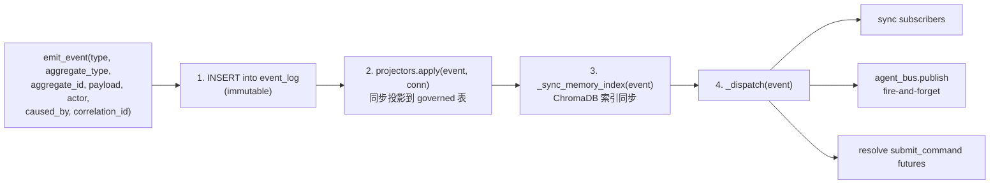

# 事件溯源

本文档解释 Personal AI Runtime 的事件溯源模型：不可变 `event_log` 是真相之源，所有业务状态都是其投影。

## 真相层：`event_log`

`event_log` 是一张 append-only 的 SQLite 表，由 SQLite 触发器强制不可变（[`backend/app/store/schema_ddl.py`](../../backend/app/store/schema_ddl.py) 的 `event_log_no_update` / `event_log_no_delete`，对 UPDATE/DELETE 执行 `RAISE(ABORT)`）。

事件结构由不可变 dataclass `Event` 定义（[`backend/app/core/runtime/kernel/event.py`](../../backend/app/core/runtime/kernel/event.py)）：

| 字段 | 含义 |
|---|---|
| `seq` | 日志分配的递增序号（主键之一） |
| `id` | 事件 UUID |
| `type` | 事件类型字符串（如 `GoalCreated`、`MessageAppended`），常量集中定义于 [`kernel/constants.py`](../../backend/app/core/runtime/kernel/constants.py) |
| `aggregate_type` | 聚合根类型（`goal`、`conversation`、`memory`、`execution` 等） |
| `aggregate_id` | 聚合实例 id |
| `actor` | 触发者（`user`、`system`、`agent:{instance_id}`、`scheduler`、`connector:*` 等） |
| `payload` | JSON 业务数据 |
| `caused_by` | 一跳因果前驱事件 id |
| `correlation_id` | 跨事件链的关联 id（如一次聊天回合） |
| `ts` | 时间戳 |

## Kernel 写入路径

唯一的写入入口是 `Kernel.emit_event()`（[`backend/app/core/runtime/kernel/kernel.py`](../../backend/app/core/runtime/kernel/kernel.py)）。它在单个 SQLite 事务内完成四件事：



关键不变量：投影与触发事件在同一事务内完成，因此投影状态始终与其原因一致。ChromaDB 同步发生在事务提交后；若失败，事件被加入 `_pending_memory_index_repairs`（上限 1000），由 [`scripts/verify_vector_consistency.py`](../../backend/scripts/verify_vector_consistency.py) 对账修复。

## 同步命令包装：`submit_command`

`Kernel.submit_command(...)`（[`kernel.py`](../../backend/app/core/runtime/kernel/kernel.py)）是 `emit_event` 的同步包装：发出请求事件后，await 一个由 `(correlation_id, completion_type)` 匹配的完成事件。默认完成类型把 `Requested` 替换为 `Completed`。HTTP API 的多数写操作（如 `POST /api/chat/approvals/{id}/resolve`、`POST /api/goals/{id}/decompose`）走这条路。

## 读路径

Kernel 提供两类读 API：

- **拉取式** `read_events(...)`（[`kernel.py`](../../backend/app/core/runtime/kernel/kernel.py)）— 支持按类型、聚合、时间、actor 等过滤的事件日志读取。
- **订阅式** `subscribe_events(handler, type, aggregate_type)`（[`kernel.py`](../../backend/app/core/runtime/kernel/kernel.py)）— 注册回调，返回反订阅函数。
- **状态查询** `query_state(selector, **filters)`（[`kernel_query_state.py`](../../backend/app/core/runtime/kernel_query_state.py)）— 从投影表读取当前状态。支持的选择器：`goals`、`work_items`、`approvals`、`memories`、`notifications`、`timer_events`、`policy_events`、`messages`、`conversations`、`inbox_emails`、`background_tasks`、`triggers`、`user_profile`。

## 投影器

投影器把不可变事件转换为可变状态（物化视图）。注册通过装饰器：

```python
@projector("GoalCreated")
def project_goal_created(event, conn):
    ...
```

实现于 [`backend/app/core/runtime/kernel/projectors_registry.py`](../../backend/app/core/runtime/kernel/projectors_registry.py)。按聚合拆分为多个文件：

| 文件 | 投影内容 |
|---|---|
| `projectors_core.py` | Goal / Task / Action 等 |
| `projectors_chat.py` | Conversation / Message |
| `projectors_aux.py` | Memory（写入 `embedding_id`） |
| `projectors_background.py` | `background_tasks` |
| `projectors_execution.py` | `handler_executions`（ExecutionRequested/Started/Retried/Paused/Resumed/Completed/Failed/Cancelled） |
| `projectors_governance.py` | `policy_events` + `grant_events`（治理事件溯源根） |
| `projectors_timer.py` | timer |
| `projectors_trigger.py` | trigger |
| `projectors_user.py` | user |

新增投影器须同时在 `projectors_registry._OWNED_TABLES` 注册所属表，`kernel.rebuild()` 才能正确清空并重建。

## 可重建性

State 是 Event Log 的纯投影，可随时清空并从日志重放重建。Kernel 提供：

- `rebuild(aggregate_type)` — 增量重建：从 `projection_checkpoints.last_applied_seq` 续放（[`scripts/verify_snapshot_rebuild.py`](../../backend/scripts/verify_snapshot_rebuild.py) 验证）。
- `rebuild_all()` — 全量重建：清空所有 governed 表后从 seq=0 重放（[`scripts/verify_rebuild.py`](../../backend/scripts/verify_rebuild.py) 验证，快照前后字节比对）。
- `save_projection_snapshots()` — 把投影序列化为快照。

## 因果链与关联

- `caused_by` 指向**直接前驱**事件 id，形成一跳因果链。
- `correlation_id` 贯穿一次逻辑操作的全部事件（如一次聊天回合的所有 `ChatRequested` → `CapabilityInvoked` → `ChatCompleted`）。

## 与传统事件溯源的差异

代码中可观察到的简化：

- **同步投影**：投影在 `emit_event` 事务内同步完成，而非异步 fan-out。优势是一致性；代价是 emit 延迟包含投影开销。
- **AgentBus 在事件日志之上**：AgentBus 不是独立消息代理，而是订阅 `event_log` 事件的内存 fan-out 层（[`backend/app/core/runtime/agent_bus.py`](../../backend/app/core/runtime/agent_bus.py)）。订阅规则支持 `event_type` / `aggregate_type` / `source_agent` / `correlation_match`，用 `fnmatch` 模式匹配。
- **混合存储**：并非所有表都是 governed 投影。`llm_calls`、`tool_calls`、`activity_log`、`app_settings` 等是 APP_STORAGE，可直访（见 [kernel-boundary.md](kernel-boundary.md)）。

## 相关验证脚本

| 脚本 | 验证内容 |
|---|---|
| [`scripts/verify_rebuild.py`](../../backend/scripts/verify_rebuild.py) | 全量重建后投影状态字节一致 |
| [`scripts/verify_snapshot_rebuild.py`](../../backend/scripts/verify_snapshot_rebuild.py) | 增量重建 + checkpoint 不回退 |
| [`scripts/verify_conversation_rebuild.py`](../../backend/scripts/verify_conversation_rebuild.py) | 对话消息可重建且 `source_event_id` 可溯源 |
| [`scripts/verify_goal_rebuild.py`](../../backend/scripts/verify_goal_rebuild.py) | 目标 `parent_id`/`progress` 重建后保留 |
| [`scripts/verify_memory_lifecycle.py`](../../backend/scripts/verify_memory_lifecycle.py) | 记忆 Derived/Updated/Deleted 全生命周期可重建 |
| [`scripts/verify_export_roundtrip.py`](../../backend/scripts/verify_export_roundtrip.py) | export → import 数据无损 |

详见 [05-engineering/testing.md](../05-engineering/testing.md)。
