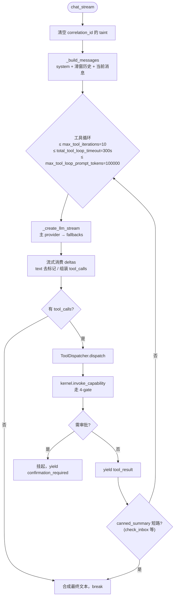

# 后端核心子系统

本文档描述后端 `backend/app/core/` 下的核心运行时子系统：Brain 推理循环、工具派发、记忆引擎、RuntimeLoop、Scheduler。API 层见 [backend-api.md](backend-api.md)，MCP 工具见 [mcp-harness.md](mcp-harness.md)。

## Brain — 推理循环

[`backend/app/core/agents/brain.py`](../../backend/app/core/agents/brain.py) 是无状态推理引擎，每个请求一个实例。核心方法 `Brain.chat_stream(conversation, user_message, system_prompt, execution_id, correlation_id)`（[`brain.py`](../../backend/app/core/agents/brain.py)）是异步生成器，产出 SSE 事件。

### 工具循环逻辑

关键实现细节：

- **滑窗历史**：`settings.max_recent_messages=50`。
- **Markup 恢复**：若没有结构化 `delta.tool_calls` 但 `assistant_content_raw` 含 `<｜tool_calls>` 标记，`parse_tool_calls`（[`tool_markup.py`](../../backend/app/core/agents/tool_markup.py)）恢复之。
- **遥测**：`_record_llm_telemetry` 优先用 provider 报告的 `usage`（CJK 精确），缺失时回退 tiktoken。
- **Canned summary**：[`tool_postprocess.py`](../../backend/app/core/agents/tool_postprocess.py) 的 `canned_summary`（当前注册 `check_inbox` / `read_inbox_email`）可短路工具循环。
- **三个硬上限**：迭代次数、总耗时、prompt token 上限。任一触发即 `_synthesize_from_tool_results` 合成最终文本退出。

公开接口：`Brain()`、`chat_stream`、`chat`（非流式包装）。

### LLM Failover

[`backend/app/core/agents/llm_failover.py`](../../backend/app/core/agents/llm_failover.py) 是多 provider 路由：

- `LLMProvider` dataclass（`name`、`api_key`、`base_url`、`model`、`provider_type`、`is_default`、`price_per_prompt_token`、`price_per_completion_token`）。
- `LLMRouter._load_providers()` 读 `runtime_config.get_llm_config()`，过滤 `enabled=True`；若无默认则自动标记第一个。
- `get_client(provider_name)` 返回缓存的 `AsyncOpenAI`（`timeout=llm_timeout_seconds`、`max_retries=3`）。
- `get_fallback_clients()` 返回所有非默认 client。
- `_provider_available`：Ollama 只需 base_url；其他需 api_key。

Failover 执行在 `BrainCompletionMixin._create_llm_stream`（[`brain_completion.py`](../../backend/app/core/agents/brain_completion.py)）：按 `[primary, *fallbacks]` 顺序尝试，每个失败记录 `LLMCallRecord(success=False)` 遥测；全部失败抛聚合 `RuntimeError`。

### 非流式续接

`BrainCompletionMixin.continue_after_tool_result(conversation, depth)`（[`brain_completion.py`](../../backend/app/core/agents/brain_completion.py)）在审批解决后做一次性补全，递归深度上限 3。

## ToolDispatcher — 工具派发

[`backend/app/core/agents/tool_dispatcher.py`](../../backend/app/core/agents/tool_dispatcher.py) 把工具调用批处理从 Brain 抽出。`ToolDispatcher(kernel, conversation).dispatch(tool_calls_data, correlation_id, execution_id)` 是异步迭代器，产出：

- `tool_call_start`
- `tool_result`（结果经 `tool_postprocess.compact_for_llm` 压缩，`conversation.save_tool_result` 持久化）
- `confirmation_required`（capability 状态为 pending 时，提前返回挂起）
- `done`
- `_dispatcher_done`（带 `results` 与 `tool_messages`）

## 记忆引擎

### MemoryEngine

[`backend/app/core/agents/memory_engine.py`](../../backend/app/core/agents/memory_engine.py) 管理完整记忆生命周期。记忆是**精炼洞察**（不是原始数据）。所有写经 Kernel（`MemoryDerived/Updated/Deleted`）；ChromaDB 是 Kernel 维护的派生搜索索引。

方法：`store_memory`、`search_relevant_memories`（委托 `kernel.recall_memory` → Chroma）、`_enrich_recall_hits`（join Chroma 命中与治理投影拿 origin/confidence）、`format_memory_context`、`retrieve_context_string`、`list_memories`、`delete_memory`、`update_memory`。

### MemoryExtractor

[`backend/app/core/agents/memory_extractor.py`](../../backend/app/core/agents/memory_extractor.py) 是 fire-and-forget 的自动事实抽取。`MemoryExtractor`（[`memory_extractor.py`](../../backend/app/core/agents/memory_extractor.py)）持有 `_pending_tasks` 强引用保护 CPython GC。

流程：
1. `schedule(text, source)` — 创建 asyncio task（无运行 loop 则 no-op）。
2. `_default_extract` — 若 `settings.memory_extractor == "cloud"` 走云；否则试 `local_llm.extract_memories`（Ollama），失败且有 `llm_api_key` 则回退云。
3. `extract_and_store` — 每条事实经 `_is_duplicate`（语义召回阈值 0.92 + 词法回退）去重后 `memory_engine.store_memory(category="fact", actor="extractor")`。

云路径用 `prepare_llm_egress(messages, purpose="memory_extract")` 审计。

### 向量索引集成

Kernel 拥有 Chroma 索引。`emit_event` 对 `MEMORY_INDEX_EVENT_TYPES` **预计算 embedding_id**，使投影器在同一 SQL 事务写入（[`kernel.py`](../../backend/app/core/runtime/kernel/kernel.py)）。失败进入 `_pending_memory_index_repairs`（上限 1000），由 [`scripts/verify_vector_consistency.py`](../../backend/scripts/verify_vector_consistency.py) 对账。

### 记忆衰减

[`backend/app/core/runtime/memory_decay.py`](../../backend/app/core/runtime/memory_decay.py) 的 `run_memory_decay(threshold=0.3, decay_to=0.1)` 查询 `decay_eligible=True` 的记忆并发 `MemoryDecayed` 事件。由每日 03:00 的 cron 触发。

### 本地 LLM

[`backend/app/core/agents/local_llm.py`](../../backend/app/core/agents/local_llm.py) 是 Ollama 包装，用于记忆抽取、事件分类、摘要，降低云成本。

## RuntimeLoop — 统一循环

[`backend/app/core/runtime/runtime_loop.py`](../../backend/app/core/runtime/runtime_loop.py) 是取代多个守护线程的单一 async 循环。

| Tick 频率 | 动作 |
|---|---|
| 每 tick（100ms） | 循环空闲 |
| 每 10 tick（~1s） | `_check_timers` — 扫描 `timer_events` 投影中 `fire_at <= now` 的项，emit `TimerFired`；对 cron 类型计算下次触发并 emit `TimerCreated` |
| 每 100 tick（~10s） | `_maintenance` — 4 件事（见下） |

`_maintenance`（[`runtime_loop.py`](../../backend/app/core/runtime/runtime_loop.py)）：
1. `agent_registry.cleanup_stale`
2. `kernel.expire_stale_approvals`
3. `_smart_notification_check` — 对停滞 ≥3 天的目标发通知（[`runtime_loop.py`](../../backend/app/core/runtime/runtime_loop.py)）
4. `_process_background_tasks` — 拉一个 pending background task，emit 状态变更 + `submit_command("BackgroundTaskRequested")`（[`runtime_loop.py`](../../backend/app/core/runtime/runtime_loop.py)）

cron 表达式解析 `_next_cron_fire(cron_expr, from_ts)`（[`runtime_loop.py`](../../backend/app/core/runtime/runtime_loop.py)）支持 `minute=*/N`、`hour`/`minute`、`day`、`day_of_week`（名称或数字）。

## Cron 注册

[`backend/app/core/runtime/cron_registry.py`](../../backend/app/core/runtime/cron_registry.py) 定义 `SCHEDULES`（[`cron_registry.py`](../../backend/app/core/runtime/cron_registry.py)）：

| 名称 | Cron | 触发 |
|---|---|---|
| morning_brief | 每天 08:00 | `TimerFired` → `handler_name=morning_brief` |
| deadline_alert | 每天 09:00 | deadline_alert |
| trigger_evaluation | 每 30 分钟 | trigger_evaluation |
| memory_decay | 每天 03:00 | memory_decay |
| world_model_snapshot | 每周日 06:00 | world_model_snapshot |
| projection_snapshots | 每天 04:00 | projection_snapshots |
| inbox_poll | 每 15 分钟 | inbox_poll |
| inbox_digest | 每天 08:30 | inbox_digest |

`init_scheduler()` 还订阅 `TaskCompleted` / `TaskStatusChanged`，自动启动依赖任务（`_on_task_completed`，[`cron_registry.py`](../../backend/app/core/runtime/cron_registry.py)）。

## Agent / 执行模型

### 单 Agent 模型（v0.4.0+）

Runtime 在 v0.4.0 移除了多 Agent 抽象（`AgentDefinition`/`AgentInstance`/`AgentRegistry` 已删），改为单一持久 agent。`agent:primary` 字符串直接由 [`agent_bootstrap.py`](../../backend/app/core/runtime/agent_bootstrap.py) 内联使用，作为 `ensure_scheduler(kernel)` 内部的 actor 标识。所有事件路由都通过 Scheduler + `@subscribe` handler 注册机制（详见 [02-concepts/runtime-algebra.md](../02-concepts/runtime-algebra.md) §4.5）。

### MVP Agent

[`backend/app/core/agents/mvp/__init__.py`](../../backend/app/core/agents/mvp/__init__.py) 定义 `CHAT_DEFINITION`：`agent_id=chat_v1`、`tools=["*"]`、订阅 `ChatRequested`/`ApproveRequested`/`ExecuteRequested`/`BackgroundTaskRequested`/`InboxPollRequested`/`TimerFired`。

Handlers（[`mvp/`](../../backend/app/core/agents/mvp/)）：

| Handler | 订阅事件 | 行为 |
|---|---|---|
| `chat_handler.py` | `ChatRequested` | 编译 prompt（`prompt_compiler`），跑 `Brain.chat_stream`，把 `text_delta`/`tool_call_start`/`tool_result` 推到 SSE 队列（不进 event_log——频率太高），emit `ChatCompleted` + `ChatDone` |
| `bypass_handlers.py` | `ApproveRequested` | 解决审批，可能经 `brain.continue_after_tool_result` 续接对话 |
| `bypass_handlers.py` | `ExecuteRequested` | 执行 action 的 `executable_plan` 步骤 |
| `bypass_handlers.py` | `BackgroundTaskRequested` | 跑 plan 步骤，附状态进度 |
| `bypass_handlers.py` | `InboxPollRequested` | 经 capability 拉未读邮件 |
| `timer_trigger_handler.py` | `TimerFired` | 按 `handler_name` 分派到 product 函数：`deadline_alert`/`trigger_evaluation`/`memory_decay`/`world_model_snapshot`/`projection_snapshots`/`inbox_poll`/`inbox_digest`/`morning_brief` |

## Scheduler — WorkItem 执行引擎

[`backend/app/core/runtime/agent_scheduler.py`](../../backend/app/core/runtime/agent_scheduler.py) 是 WorkItem 执行引擎。

- `__init__` 调 `_recover()` 扫描中断的 `handler_executions`，重放为 `ExecutionRetried(reason=interrupted)`。
- 循环每 50ms tick，每 tick 处理至多 `_MAX_CONCURRENT=8` 个 item。
- `enqueue(instance_id, actor, event, policy)` → 查 handler → 创建 WorkItem → emit `ExecutionRequested`。
- `_process_work_item` 在 `execution_scope(item.id)` 内跑 handler，使能力调用正确归属。
- `_emit_verify` 每次写后跑 `verify_persist_matches_projection`（影子比对）。
- `ExecutionPolicy(timeout=30s, max_retries=3, retry_delay=5s)`。
- `get_scheduler(kernel)` 是单例工厂。

### WorkItem 与 ExecutionContext

- [`work_item.py`](../../backend/app/core/runtime/work_item.py) — 原子执行单元，状态机 `pending → running → completed | failed → retrying → running`，持久化于 `handler_executions`。`to_row`/`from_row` 用于序列化。
- [`execution_context.py`](../../backend/app/core/runtime/execution_context.py) — 最小 handler 上下文（`instance_id`、`actor`、`correlation_id`、`_kernel`、`principal`、`execution_id`），暴露 `emit()`。
- [`handler_registry.py`](../../backend/app/core/runtime/handler_registry.py) — 事件类型 → async handler 映射，`@subscribe("EventType")` 装饰器注册。
- [`execution_shadow_compare.py`](../../backend/app/core/runtime/execution_shadow_compare.py) — ADR-0007 Step 2 验证：每次双写后比对 `WorkItem.to_row()`（真相 A）与 `handler_executions` 投影（真相 B）。

### SSE 队列

[`backend/app/core/runtime/sse_queue_registry.py`](../../backend/app/core/runtime/sse_queue_registry.py) — 每个 `correlation_id` 一个内存 `asyncio.Queue`，用于聊天流式。避免每个 turn 在 event_log 写入数百条 `ChatTextDelta`。

## AgentBus

[`backend/app/core/runtime/agent_bus.py`](../../backend/app/core/runtime/agent_bus.py) 是事件日志**之上**的轻量内存 fan-out（不是独立 broker——event_log 才是 bus）。`SubscriptionRule`（`event_type`/`aggregate_type`/`source_agent`/`correlation_match`）用 `fnmatch` 模式匹配。`publish(event)` 解析订阅者、放入每 agent 队列（maxsize 256）、直接调 handler。失败记日志但不阻塞。

## 其他核心组件

| 文件 | 职责 |
|---|---|
| [`state_manager.py`](../../backend/app/core/runtime/state_manager.py) | 统一状态机（`TaskStatus` 枚举 + `_TRANSITIONS` 校验） |
| [`runtime_config.py`](../../backend/app/core/runtime/runtime_config.py) | LLM/Email 设置持久化于 SQLite `app_settings`；env 播种默认；UI 编辑持久化 DB；遗留 `runtime_config.json` 自动迁移。`PROVIDER_TYPES`、`PROVIDER_PRESETS`、`effective_api_key`、`get_llm_config(masked)`、`update_llm_config`、`get_email_config`、`get_generation_params`、`get_prompt`/`save_prompt` |
| [`conversation_recorder.py`](../../backend/app/core/runtime/conversation_recorder.py) | 追加 `ConversationRecorded` 事件（用户↔助手回合的不可变 Experience 表示） |
| [`timer_engine.py`](../../backend/app/core/runtime/timer_engine.py) | Cron 调度注册（扫描已迁移到 RuntimeLoop）：`ensure_schedules`/`create_schedule`/`list_schedules`/`delete_schedule` |
| [`reaction_registry.py`](../../backend/app/core/runtime/reaction_registry.py) | v0.6.0 声明式触发器（替代已删除的 `trigger_engine`） |
| [`background_worker.py`](../../backend/app/core/runtime/background_worker.py) | 后台任务生命周期公开 API（轮询在 RuntimeLoop） |
| [`task_engine.py`](../../backend/app/core/runtime/task_engine.py) | WorkItem CRUD 模块函数（`work_type=task`，底层 emit `WorkItem*` 事件） |
| [`notification_channel.py`](../../backend/app/core/runtime/notification_channel.py) | 可插拔通道：`DesktopChannel`（WS 广播）、`WebhookChannel`（HTTP POST）、`NtfyChannel`（ntfy.sh）。`NotificationRouter.notify()` 扇出 |
| [`notification_bridge.py`](../../backend/app/core/runtime/notification_bridge.py) | 同步→异步桥；`push_notification` 持久化+广播，`broadcast_event` 纯传输 |
| [`telemetry/telemetry.py`](../../backend/app/core/telemetry/telemetry.py) | 记录每次 LLM 调用（`LLMCallRecord`）与工具调用（`ToolCallRecord`）到 `llm_calls`/`tool_calls` 表 |
| [`world_model.py`](../../backend/app/core/agents/world_model.py) | 30 天滚动生活快照（活跃目标、近期完成、近期活动类型）。缓存；周 cron 刷新 |
| [`user_profile.py`](../../backend/app/core/agents/user_profile.py) | 结构化画像（偏好/价值观/关系/健康/财务/职业），置信度评分、30 天时间衰减、冲突解决。经 `UserProfileUpdated` 事件写 |
| [`startup_health.py`](../../backend/app/core/startup_health.py) | `run_startup_checks()` 校验存储路径、LLM 配置、认证、邮件。`enrich_with_mcp_status`、`sanitize_startup_for_public` |
| [`rate_limit.py`](../../backend/app/core/rate_limit.py) | 内存令牌桶（按端点前缀）：`/api/chat` 30/60s、`/api/settings/llm/test` 5/60s、`/api/settings/email/test` 5/60s、`/api/inbox/poll` 10/60s、`/api/system/export` 3/60s |
| [`logging_config.py`](../../backend/app/core/logging_config.py) | structlog + stdlib；`_request_id_processor` 把 `request_id_var` 附到每行日志 |
| [`connectors/calendar_capture.py`](../../backend/app/core/connectors/calendar_capture.py) | 只读连接器，把日历事件摄入为 `ObservationRecorded` |
