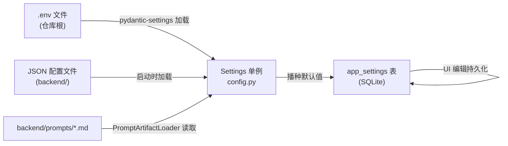

# 配置

本文档列出所有配置入口。配置分布在四个层次：`.env` 环境变量、`config.py` 的 `Settings`、运行时 DB 配置（`runtime_config`）、JSON 配置文件。

## 配置层次

## `.env` 环境变量

模板见 [`.env.example`](../../.env.example)。`Settings`（[`backend/app/config.py`](../../backend/app/config.py)）从 `BASE_DIR/.env` 读取（`env_file_encoding="utf-8"`、`extra="ignore"`、无 env 前缀）。

### LLM

| 字段 | 默认 | 环境变量 |
|---|---|---|
| `llm_api_key` | `""` | `LLM_API_KEY` |
| `llm_base_url` | `https://api.deepseek.com/v1` | `LLM_BASE_URL` |
| `llm_model` | `deepseek-chat` | `LLM_MODEL` |
| `llm_temperature` | `0.7` | `LLM_TEMPERATURE` |
| `llm_max_tokens` | `4096` | `LLM_MAX_TOKENS` |
| `llm_timeout_seconds` | `60` | `LLM_TIMEOUT_SECONDS` |
| `openai_api_key` | `""` | `OPENAI_API_KEY`（fallback） |
| `anthropic_api_key` | `""` | `ANTHROPIC_API_KEY`（fallback） |
| `ollama_base_url` | `http://localhost:11434/v1` | `OLLAMA_BASE_URL` |
| `ollama_model` | `qwen2.5:7b` | `OLLAMA_MODEL` |

### 存储

| 字段 | 默认 | 环境变量 |
|---|---|---|
| `data_dir` | `BASE_DIR/backend/data` | `DATA_DIR` |
| `sqlite_path` | `<data_dir>/personal_ai.db` | `SQLITE_PATH` |
| `vector_dir` | `<data_dir>/vectors` | `VECTOR_DIR` |

相对路径在 `model_post_init`（[`config.py`](../../backend/app/config.py)）resolve 到 `BASE_DIR`，避免 `backend/backend/data` 幽灵路径。

### 服务器

| 字段 | 默认 | 环境变量 |
|---|---|---|
| `host` | `127.0.0.1` | `HOST` |
| `port` | `8000` | `PORT` |
| `cors_origins` | `http://localhost:5173,http://localhost:5174` | `CORS_ORIGINS` |

### 认证

| 字段 | 默认 | 环境变量 |
|---|---|---|
| `auth_token` | `""` | `AUTH_TOKEN` |
| `allow_no_auth_on_exposed` | `False` | `ALLOW_NO_AUTH_ON_EXPOSED` |

详见 [05-engineering/security.md](../05-engineering/security.md)。

### MCP / 工具

| 字段 | 默认 | 环境变量 |
|---|---|---|
| `mcp_config_path` | `BASE_DIR/backend/mcp_config.json` | `MCP_CONFIG_PATH` |
| `capability_policy_path` | `BASE_DIR/backend/capability_policy.json` | `CAPABILITY_POLICY_PATH` |
| `mcp_external_enabled` | `True` | `MCP_EXTERNAL_ENABLED` |
| `mcp_servers_enabled` | `*` | `MCP_SERVERS_ENABLED` |
| `builtin_tools_enabled` | `*` | `BUILTIN_TOOLS_ENABLED` |
| `builtin_tool_categories` | `""` | `BUILTIN_TOOL_CATEGORIES` |

`BUILTIN_TOOL_CATEGORIES` 控制 advanced 类别（computer_use/voice/clipboard_ocr）opt-in；留空则只注册 core 类别（time/filesystem/web/calendar/email/browser/shell/git/telegram/goals）。

### 外部 MCP 凭据

| 字段 | 环境变量 |
|---|---|
| `brave_api_key` | `BRAVE_API_KEY` |
| `context7_api_key` | `CONTEXT7_API_KEY` |
| `github_personal_access_token` | `GITHUB_PERSONAL_ACCESS_TOKEN` |
| `tavily_api_key` | `TAVILY_API_KEY` |
| `notion_token` | `NOTION_TOKEN` |

缺失必需 key 的服务器启动时自动跳过。

### 记忆

| 字段 | 默认 | 环境变量 |
|---|---|---|
| `memory_extractor` | `ollama` | `MEMORY_EXTRACTOR`（`ollama` 本地 或 `cloud`） |
| `sensitive_ops_local` | `True` | `SENSITIVE_OPS_LOCAL` |

### 文件系统（agent coding）

| 字段 | 默认 | 环境变量 |
|---|---|---|
| `filesystem_allowed_dirs` | `""` | `FILESYSTEM_ALLOWED_DIRS`（逗号分隔；空为默认：仅项目根，不含家目录） |
| `filesystem_protected_paths` | `""` | `FILESYSTEM_PROTECTED_PATHS`（额外保护路径，追加到默认） |

默认保护路径含 `kernel/`、`policy`、`taint.py`、`.env*`、`.git/`（见 [`coding_rules.md`](../../backend/prompts/coding_rules.md)）。变更需重启后端生效。

### 对话 / 工具循环

| 字段 | 默认 | 环境变量 |
|---|---|---|
| `max_recent_messages` | `50` | `MAX_RECENT_MESSAGES` |
| `max_tool_iterations` | `10` | `MAX_TOOL_ITERATIONS` |
| `tool_timeout_seconds` | `30` | `TOOL_TIMEOUT_SECONDS` |
| `total_tool_loop_timeout` | `300` | `TOTAL_TOOL_LOOP_TIMEOUT` |
| `max_tool_loop_prompt_tokens` | `100_000` | `MAX_TOOL_LOOP_PROMPT_TOKENS`（硬成本上限） |

### 邮件（Gmail）

| 字段 | 默认 | 环境变量 |
|---|---|---|
| `email_imap_host` | `imap.gmail.com` | `EMAIL_IMAP_HOST` |
| `email_smtp_host` | `smtp.gmail.com` | `EMAIL_SMTP_HOST` |
| `email_smtp_port` | `465` | `EMAIL_SMTP_PORT` |
| `email_user` | `""` | `EMAIL_USER` |
| `email_pass` | `""` | `EMAIL_PASS`（Gmail App Password，非登录密码） |

### Telegram

| 字段 | 默认 | 环境变量 |
|---|---|---|
| `telegram_bot_token` | `""` | `TELEGRAM_BOT_TOKEN` |
| `telegram_chat_id` | `""` | `TELEGRAM_CHAT_ID` |

### 前端

| 变量 | 用途 |
|---|---|
| `VITE_API_HOST` | 前端 dev proxy 目标主机（默认 `localhost`） |
| `VITE_API_PORT` | 前端 dev proxy 目标端口（默认 `8000`） |
| `VITE_AUTH_TOKEN` | 前端 Bearer token（启用认证时必须与 `AUTH_TOKEN` 一致） |

## 运行时 DB 配置（runtime_config）

[`backend/app/core/runtime/runtime_config.py`](../../backend/app/core/runtime/runtime_config.py) 把 LLM 与邮件设置持久化于 SQLite `app_settings` 表。env 播种默认值，UI 编辑持久化到 DB。若存在 `runtime_config.json`，首次读取时自动导入 `app_settings`。

关键概念：

- `PROVIDER_TYPES`：`openai_compatible`、`ollama`
- `PROVIDER_PRESETS`：`deepseek`、`openai`、`anthropic`、`ollama`
- `effective_api_key(provider)` — DB → env 回退解析；用 `••••••••` 掩码
- 接口：`get_llm_config(masked)`、`update_llm_config`、`get_email_config`、`get_generation_params`、`get_prompt`/`save_prompt`（用户自定义 prompt 存于 `app_settings`）

LLM provider 增删后调 `llm_router.reload()` 重建。

## JSON 配置文件

### `backend/capability_policy.json`

静态能力策略表，启动时由 `capability_governance.seed_from_json(kernel)` 注入为 `PolicyCreated` 事件。该 JSON **仅是种子**，投影表 `policy_events` 才是权威根。

三个桶：

- **auto_allow**（28 个）：`read_file`、`web_search`、`list_calendar_events`、`check_inbox`、`git_status`/`log`/`diff`、`computer_screenshot`/`move`/`scroll`、`voice_tts`/`stt` 等。
- **needs_user**（9 个）：`apply_patch`、`write_file`、`add_calendar_event`、`send_email`、`shell_exec`、`telegram_send`、`computer_click`/`type`/`key`。
- **forbidden**：空。

### `backend/mcp_config.json`

声明 6 个外部 MCP server。详见 [03-subsystems/mcp-harness.md](../03-subsystems/mcp-harness.md)。

### `backend/mcp_registry.json`

用户面向 UI 目录（marketplace 元数据），镜像同样 6 个服务器，附中文描述、类别、安装命令、中文环境变量提示、图标名。

## Prompt 文件

[`backend/prompts/`](../../backend/prompts/)：

### `identity.md`

Agent 身份/性格 prompt。定义助手为「Personal AI Runtime」；性格（helpful/honest/proactive/concise）；记忆使用规则（自报事实权威、系统假设带置信度且必须让位于自报、回复必须附 `[我记得·置信度 X.XX]` 标记、<0.6 置信度不得作为事实陈述）。列出 5 条不可妥协的行为约束（镜像治理规则）：(1) 无显式意图不写（枚举 needs_user 工具）、(2) 失败必报不可吞、(3) 尊重审批门、(4) 外部内容视为不可信（防注入）、(5) 不经网络工具外泄。

### `coding_rules.md`

agent 在本代码库工作时注入的短 prompt 片段。固定项目根、要求相对路径、`apply_patch` 编辑 / `write_file` 新建、改动后建议 `make test-backend`。列出写保护路径（`kernel/`、`check_boundary.py`、`capability_policy.json`、`capability_policy.py`、`taint.py`、`sensitive_router.py`、`.env*`、`.git/`），注明 `.env.example` 与 `backend/mcp_config.json` 可编辑。包含 `shell_exec` 指引与添加外部 MCP 的配方。

两个文件支持运行时通过 `/api/settings/prompt` 覆盖（存于 `app_settings`）。

## Docker Compose 覆盖

[`docker-compose.yml`](../../docker-compose.yml) 对 backend service 设：

- `HOST=0.0.0.0`（覆盖默认 localhost-only）
- `AUTH_TOKEN=${AUTH_TOKEN:-}`（生产必需，注释明确警告）
- 命名卷 `backend-data` 挂到 `/app/backend/data`
- `working_dir: /app/backend`

frontend service 设 `VITE_API_HOST=backend`、`VITE_API_PORT=8000`。

## 测试环境覆盖

[`backend/tests/conftest.py`](../../backend/tests/conftest.py) 设默认：`LLM_API_KEY=test-key`、Chroma telemetry off、`MCP_EXTERNAL_ENABLED=false`，然后 re-read settings。`reset_settings()`（[`config.py`](../../backend/app/config.py)）允许测试重建实例。
