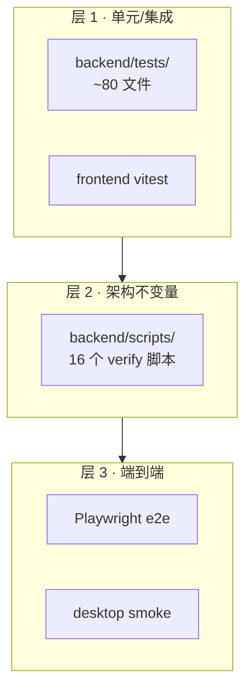

# 测试

本文档描述三层测试策略：(1) pytest 单元/集成、(2) 独立 verify 脚本强制架构不变量、(3) Playwright e2e + desktop smoke。

## 测试分层



每层都接入 [ci-cd.md](ci-cd.md) 的 GitHub Actions。

## 层 1：pytest

### 组织（[`backend/tests/`](../../backend/tests/)）

| 目录 | 内容 |
|---|---|
| `agents/` | agent 层单测：brain 遥测、computer_use/voice import 安全、token_counter、tool_dispatcher、tool_markup/postprocess |
| `api/` | API 覆盖冒烟（`test_api_coverage.py`） |
| `integration/` | FastAPI TestClient + Kernel：approval flow、auth、b2/b3 审计、dashboard、goals/knowledge/settings/system/timeline/trigger API、workflows（v0.2 skip） |
| `product/` | 基于 Kernel 的产品层：dashboard、encrypted_sync、inbox、notifications |
| `runtime/` | kernel/执行/治理核心（~80 文件） |

顶层还有：`test_context_policy.py`、`test_context_runtime_stage3.py`、`test_core_tier_fragments.py`、`test_pipeline_integration.py`、`test_prompt_artifact.py`、`test_policy_coverage.py`、`test_fragment_cleanup_phase5.py`、`test_fragment_read_boundary.py`、`test_mail_fragments.py`、`test_version.py`。

### conftest 隔离

[`backend/tests/conftest.py`](../../backend/tests/conftest.py)：

- 设默认 env（`LLM_API_KEY=test-key`、Chroma telemetry off、`MCP_EXTERNAL_ENABLED=false`），re-read settings。
- **autouse fixture `_reset_runtime`**：每个测试间调 `runtime.reset()` 清空泄漏的全局单例（`agent_bus`、`capability_policy`、`taint_registry`、`source_registry`）。
- **`isolated_kernel` fixture**：在 `tmp_path` 下构建全新 Kernel + Database，monkey-patch `kernel_instance.kernel` 与 `database.db`。

集成子 conftest（[`tests/integration/conftest.py`](../../backend/tests/integration/conftest.py)）提供 `client`/`authed_client` fixture，reload `app.api.system`/`app.main`，stub `start_mcp_mesh`/`stop_mcp_mesh`，每测设独立 `SQLITE_PATH`/`DATA_DIR`/`VECTOR_DIR`。

### runtime/ 覆盖范围（节选）

- **事件溯源与重建**：`test_event_sourcing.py`、`test_engine_rebuild.py`、`test_memory_belief.py`、`test_conversation_recorded.py`、`test_actions_event_sourced.py`、`test_goals_event_sourced.py`
- **边界与归属守卫**：`test_boundary_guard.py`、`test_execution_ownership_guard.py`、`test_projection_provenance_guard.py`、`test_projection_schema_contract.py`
- **执行模型（ADR-0007 Step 1–5）**：`test_execution_model.py`、`test_execution_events.py`、`test_execution_context.py`、`test_execution_recovery.py`、`test_execution_shadow_compare.py`、`test_execution_ownership.py`
- **Agent bus / 隔离 / 恢复**：`test_agent_bus.py`、`test_agent_isolation.py`、`test_agent_recovery.py`、`test_d1_concurrent_isolation.py`
- **Scheduler / timer / trigger**：`test_scheduler.py`、`test_scheduler_deadline.py`、`test_scheduler_extended.py`、`test_coverage_engines.py`、`test_trigger_engine_extended.py`
- **能力治理与策略（T2/A3/C3）**：`test_capability_approval.py`、`test_capability_decision.py`、`test_capability_forbidden.py`、`test_c3_mcp_policy_eventsourcing.py`、`test_runtime_config.py`、`test_taint.py`、`test_sensitive_router.py`
- **出口与连接器**：`test_egress.py`、`test_connector.py`、`test_browser_ssrf.py`、`test_fetch_ssrf.py`、`test_url_safety.py`、`test_web_search_html.py`
- **MCP / filesystem / shell / email server**：`test_filesystem_server.py`、`test_shell_server.py`、`test_email_server.py`、`test_mcp_config.py`、`test_mcp_mesh.py`
- **记忆 / 通知 / 后台**：`test_memory_extractor.py`、`test_memory_ws_notify.py`、`test_notification_bridge.py`、`test_notification_channel.py`、`test_sse_queue_registry.py`、`test_background_worker_extended.py`、`test_background_task_event_chain.py`
- **Product / 主权 / fragment**：`test_dashboard_data.py`、`test_dashboard_extended.py`、`test_sovereignty_basic.py`、`test_governance_fragment.py`、`test_scenario_fragments.py`、`test_mail_fragments.py`、`test_fragment_read_boundary.py`、`test_fragment_cleanup_phase5.py`、`test_runtime_container.py`

### 运行

```bash
make test-backend     # cd backend && pytest tests/ -q -m "not live_llm"
```

`-m "not live_llm"` 排除需要真实 LLM API 的测试。

### 覆盖率策略（v0.9.0 更新）

**覆盖率是结果，不是目标。**

CI 的 `--fail-under` 阈值定在 75（runtime）和 50（api），不是 90+。理由：

- **覆盖率高 ≠ 测试质量高**。低覆盖率套件如果测的是核心不变量，比高覆盖率套件全是断言 `"T" in iso_string` 这种实现细节更有价值。
- **高阈值反而鼓励坏测试**。当开发者被强制把 coverage 推到 83% 才能合并，他们会写出大量 `test_coverage_*.py` 测试，绑死实现细节（ISO 时间格式、字符串前缀），重构时大量失败，最终开发者学会「绕开测试」而不是「修测试」。
- **行为测试 > 实现测试**。优先写：核心不变量（事件可重建、Kernel 边界、能力 4-gate）、用户可见行为（API 端到端）、回归（特定 bug 修复）。少写：函数能不能跑过、字符串格式、私有方法。

CI 报告用 `--cov-report=term-missing` 让缺失部分可见，开发者按需补充而不是被阈值驱动。

新增的 `test_coverage_*.py` 文件应在 PR review 中被质疑——它们通常是为覆盖率而生，不是为保护行为而生。如果确实需要覆盖某函数，把它放进对应主题的测试文件（如 timer 相关测试进 `test_scheduler*.py`）。

## 层 2：架构不变量脚本

16 个独立脚本（[`backend/scripts/`](../../backend/scripts/)），每个验证一个不变量。全部接入 `make ci-local` 与 GitHub Actions。

### 边界 / 归属 / 溯源

| 脚本 | 不变量 | 机制 |
|---|---|---|
| [`check_boundary.py`](../../backend/scripts/check_boundary.py) | Kernel 写入独占 | 静态正则扫描 User Space 的 DML/SELECT/import 违规。模式：默认（新违规失败）、`--inventory`（列全部，退出 0）、`--strict`（连 allowlist 债也失败） |
| [`check_execution_ownership.py`](../../backend/scripts/check_execution_ownership.py) | 每次 `invoke_capability` 必带 `execution_id` | 静态扫描，平衡括号捕获完整调用文本，检查子串 `execution_id`。同样三种模式 |
| [`check_projection_provenance.py`](../../backend/scripts/check_projection_provenance.py) | 每条 governed 投影行有对应 `event_log` 事件 | 运行时 SQL join（接受 `--db` 或自启 Kernel 到 `data/verify_provenance.db` 并跑 bootstrap 场景） |

### 事件日志可重建性

| 脚本 | 验证 |
|---|---|
| [`verify_rebuild.py`](../../backend/scripts/verify_rebuild.py) | 旗舰：发大型 `SAMPLE_SCENARIO`（goals/approvals/memories/tasks/actions/conversation+message/notification/policy/grant/timer），快照 11 张投影表，`rebuild_all()`，再快照，字节比对 |
| [`verify_snapshot_rebuild.py`](../../backend/scripts/verify_snapshot_rebuild.py) | 增量重建：`save_projection_snapshot("goal")` 后发 2 个事件，`rebuild("goal")`，验证只重放 2 个事件；再发 `GoalUpdated` 后 export，验证 checkpoint 的 `last_applied_seq` 严格前进 |
| [`verify_conversation_rebuild.py`](../../backend/scripts/verify_conversation_rebuild.py) | 发 ConversationCreated + 2 MessageAppended，rebuild，验证 2 条消息且 `source_event_id` 可溯源 |
| [`verify_goal_rebuild.py`](../../backend/scripts/verify_goal_rebuild.py) | 父子目标 + GoalUpdated，验证 `parent_id`/`progress` 重建后保留 |
| [`verify_memory_lifecycle.py`](../../backend/scripts/verify_memory_lifecycle.py) | MemoryDerived → Updated(0.7→0.9) → rebuild → 验证 0.9 保留 → Deleted → 验证消失 |

### 数据主权

| 脚本 | 验证 |
|---|---|
| [`verify_export_roundtrip.py`](../../backend/scripts/verify_export_roundtrip.py) | 源 DB 播种 goal+memory+2 消息会话+notification，`export_all()`，新 DB `import_all(read_only=False)`，验证 event_log/conversations/messages/goals/memories/notifications 计数一致 + 内容可还原 |

### 审计链

| 脚本 | 验证 |
|---|---|
| [`verify_egress.py`](../../backend/scripts/verify_egress.py) | 装 Kernel 单例，调 `prepare_llm_egress` 含 identity 关键词 payload，验证分类为 `identity_surface`、`identity_surface_detected`、消息原样返回、`EgressApproved` 事件已发；benign payload 分类为 `general` |
| [`verify_inbox_audit.py`](../../backend/scripts/verify_inbox_audit.py) | 发 `InboxEmailRecorded`（`caused_by="evt_trigger_001"`），验证事件在 event_log 且 `caused_by` 链保留 |
| [`verify_connector.py`](../../backend/scripts/verify_connector.py) | 写最小 `.ics`，swap CalendarServer 单例，调 `capture_calendar_observations`，验证 `ObservationRecorded` 事件存在且 actor 以 `connector:` 开头 |

### 一致性

| 脚本 | 验证 |
|---|---|
| [`verify_vector_consistency.py`](../../backend/scripts/verify_vector_consistency.py) | 自测：发 2 个 MemoryDerived，比对 SQLite `memories` id 集合 vs Chroma `memories` collection；可选 `--db`/`--vector-dir`/`--check-default` 对账真实数据目录 |
| [`verify_alembic.py`](../../backend/scripts/verify_alembic.py) | 开 db 单例，查 `sqlite_master`，验证 20 张 `REQUIRED_TABLES` 存在 + `PRAGMA foreign_keys=1` |

### 演示

| 脚本 | 用途 |
|---|---|
| [`seed_demo.py`](../../backend/scripts/seed_demo.py) | 幂等播种演示数据 |
| [`demo_data_sovereignty.py`](../../backend/scripts/demo_data_sovereignty.py) | 引导式 CLI 演示数据主权叙事（非不变量） |

## 层 3：端到端

### Playwright（[`frontend/e2e/chat-approval.spec.ts`](../../frontend/e2e/chat-approval.spec.ts)）

用 [`e2e/helpers.ts`](../../frontend/e2e/helpers.ts) 的 `MockApiRouter` 全 stub 后端。覆盖：

- **导航/页面**：侧栏+导航、goals 渲染 `学习 Rust`、memories 渲染 `用户喜欢喝咖啡`、dashboard 显示 `AI 概览`/`AI 记住了`、settings 显示 `导出全部数据`+`数据主权`、approvals 空 state `暂无待审批`。
- **聊天流**：`/chat/:id` 输入框 placeholder `输入消息`、`发送` 按钮。
- **聊天审批流**（headline）：mock SSE 流返回 `confirmation_required`（工具 `write_file`、`approval_id=ap-e2e-1`），断言 `确认写入文件` 对话框出现，点 `确认执行`，断言对话框在 `/api/chat/approvals/ap-e2e-1/resolve` 返回 approved 后消失；另一测试点 `取消` 验证 deny。
- **错误处理**：telemetry 端点 500 时 dashboard 显示 `重试`。
- **新页面**：timeline（`人生时间线`、含 `BeliefFormed` 事件）、knowledge 上传区+文档列表、dashboard 数据主权面板（`1,250` events、`121` memories、`全部本地存储`、`导出我的数据`）。

运行：`make test-e2e`（先 `npx playwright install chromium`）。

### Desktop smoke（[`desktop/main.test.js`](../../desktop/main.test.js)）

vitest，**不需要 Electron 已安装**。读 `main.js` 源码，字符串 `toContain` 断言：

- 源码作为有效 JS 解析（`new Function(source)`）。
- 常量 `WEB_URL`/`BACKEND_URL`/`AUTH_TOKEN` 存在。
- 函数 `createMainWindow`/`createTray`/`connectWebSocket` 存在。
- 调用 `globalShortcut.register`、`setLoginItemSettings`。
- IPC 通道 `get-backend-url`/`send-notification` 存在。

运行：`cd desktop && npm test`。

### 前端单元（vitest）

`auth.test.ts`、`api/client.test.ts`，组件测试（`Button/Input/Dialog/Sidebar/MessageItem/ToolCallDisplay/ContextPanel/ConfirmationDialog/ChatView/ui.snapshots`），页面测试（`Dashboard/Inbox/Memories/Goals/Settings/Portrait/TrustReport`）。运行：`make test-frontend`（含 `tsc --noEmit`）。

## Soak 测试（ADR-0007 Step 3）

[`scripts/`](../../scripts/) 下的 soak 脚本模拟长时间运行：

| 脚本 | 场景 |
|---|---|
| [`soak_recovery.py`](../../scripts/soak_recovery.py) | 四阶段崩溃/重启模拟：spawn soak agent + 阻塞 handler → 入队 N 个 work item → scheduler 接手 → 停 scheduler 并强 emit `ExecutionStarted`（模拟崩溃）→ 验证 item 卡在 running → 新 Scheduler `_recover()` → 验证 `ExecutionRetried(reason=interrupted)` 全存在、无 item 卡 running、shadow-compare 0 mismatch、`rebuild("execution")` 后 `handler_executions` 字节一致 |
| [`soak_trigger.py`](../../scripts/soak_trigger.py) | 累积执行：注册 no-op handler，每 7 批用 30% 失败率演练重试 + shadow compare；发 N 个 `SoakTrigger` 事件走真实 `emit → AgentBus → Scheduler → _persist_emit_verify` 循环 |
| [`soak_stats.py`](../../scripts/soak_stats.py) | 只读报告：`handler_executions` 状态分布、完成数（基线 100）、`ExecutionRetried(interrupted)` 计数、事件类型分布 |

## 覆盖率

[`backend/pyproject.toml`](../../backend/pyproject.toml) 的 `[tool.coverage.run]`：

- `source = ["app/api", "app/product"]`
- `omit`：`app/experimental/*`、`app/core/runtime/memory_decay.py`、`runtime_container.py`、`runtime_loop.py`、`capability_governance.py`、`capability_policy.py`、`app/api/workflows.py`（v0.2.0 注销的死代码）

CI 两个 `--fail-under` 门：`app/core/runtime/*` ≥84%、`app/api/*` ≥50%。
