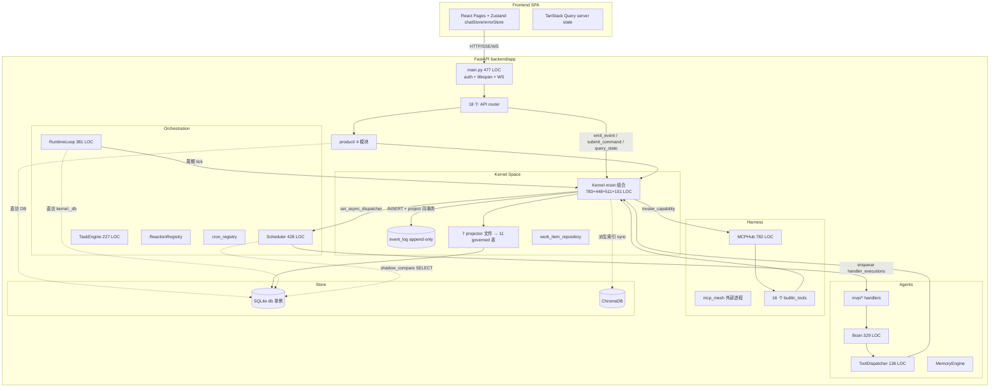
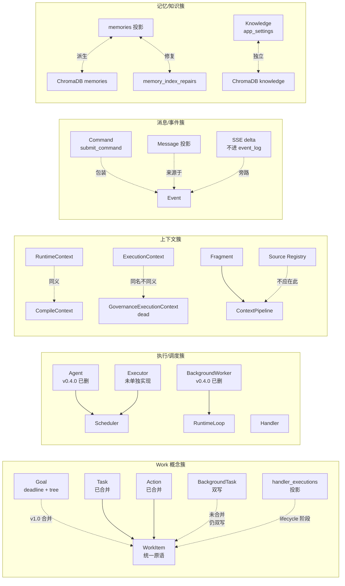

# Personal AI Runtime — Architecture Survival Review

> **审查日期**：2026-07-05
> **被审查版本**：v0.2.0（[`backend/app/version.py`](../backend/app/version.py)）
> **调查范围**：backend/app (21,733 LOC)、backend/tests (12,985 LOC)、backend/scripts (3,326 LOC)、frontend/src (11,630 LOC)、docs (3,602 LOC)、CI / Makefile / Docker / desktop。
> **方法论**：所有结论均可追溯到 `file:line`；无证据的标 UNKNOWN；不做"优化建议"，只描述风险与证据。

---

## v0.3.0 修复进度（2026-07-07）

| 问题 | 状态 | Commit |
|---|---|---|
| Low #19 — inbox/goals LLM 未走 prepare_llm_egress | ✅ 关闭 | `acd15d1` |
| Critical #2 — builtin_tools/goals.py 绕治理 | ✅ 关闭 | `ebde549` |
| High #6 — CI flaky approval_resolve | 🟡 部分（xfail + scheduler loop 检测加固） | `b74ab83` |
| Medium #11 — task_engine 包装层 | ✅ 关闭（TaskEngine 类/单例删除） | `b007d61` |
| Medium #11 — governance/execution_context.py dead code | ✅ 关闭 | `25146d3` |
| Medium #11 — world_model 判定 | 🟢 修订：保留（缓存层有价值） | `87b2a32` |
| Critical #1 — tool_calls 双写漂移 | ✅ 关闭 | `5077850` |
| Low — app_settings 审计盲区（save_prompt / knowledge_docs） | ✅ 关闭 | `00a8315` |
| Critical #1 — llm_calls 双写漂移 | ⏸  **deferred v0.3.1**：需新增 LLMCallRecorded 事件，违反概念零和契约；无 dead event 可配平。待 (a) 找到可删事件或 (b) 将 ChatCompleted payload 扩展含遥测字段后重新评估 | — |
| High #3 — Kernel 内部绕 ABI | ⏸  **deferred v0.3.1**：runtime_loop/scheduler 直访 kernel._db 待治理 | — |
| Medium #13 — 游离单例 | ✅ **trivial 批次关闭**：sse_queues/memory_repairs/prompt_compiler/world_model/telemetry/identity/sensitive 7/11 纳入 reset。runtime_loop/db/vector_store 需跨 event-loop 两阶段 reset，deferred v0.3.1 | `94e7219` |

---

## 第一阶段：系统模型

### 1. 一句话描述

**这是一个事件溯源 + Kernel 写入独占的单机个人 AI 运行时；前后端分离 + Electron 包装；以 SQLite 为真相层、ChromaDB 为派生索引、`event_log` 为唯一写入入口；但 APP_STORAGE 层和 Kernel 内部仍有绕过事件溯源的直访路径。**

### 2. 系统分层（代码证明，不是文档声明）

| 层 | 实际位置 | 守卫 |
|---|---|---|
| User Space | `backend/app/api/`、`backend/app/fragments/`、`backend/app/core/agents/`、`backend/app/product/`、`backend/app/chat/` | `backend/scripts/check_boundary.py:21-31` 静态扫描 governed 表 |
| Kernel Space | `backend/app/core/runtime/kernel/`（kernel.py + 3 mixins + 7 projectors + constants + event + query_builder + work_item_repository） | 无运行时守卫，仅 CI 静态扫描 |
| App Storage | `backend/app/store/database.py`（全局 `db` 单例 L121）+ 11 张 APP_STORAGE 表 | `check_boundary.py:82-91` 显式 allowlist |
| Infrastructure | `backend/app/store/vector.py`（ChromaDB）、`backend/app/core/harness/mcp_mesh.py`（外部 MCP 进程）、`backend/app/core/runtime/runtime_loop.py`（100ms tick） | 无 |

### 3. 模块关系图



### 4. 核心依赖方向

**正向（合法）**：User Space → `kernel` lazy proxy → Kernel ABI → DB/Chroma。

**违规（实测）**：
- `runtime_loop.py:235 db = kernel._db` 后直接读写 `memory_index_repairs`（绕 ABI）
- `runtime_loop.py:237,260,269,290,302,328` 多处直接 SQL 操作
- `agent_scheduler.py:65 with kernel._db.get_db() as conn: SELECT * FROM handler_executions`（shadow_compare 路径）
- `product/inbox.py:38,145,153-156,176,199-202,248-249,261-264,329,373-374,384` 直访 `inbox_emails`
- `core/telemetry/telemetry.py:52-69,74-87,91,108,130,145,153,190` 直访 `llm_calls`/`tool_calls`
- `core/runtime/runtime_config.py:206,263,420,437` 直访 `app_settings`
- `api/knowledge.py:42,57` 直访 `app_settings` 与 ChromaDB `knowledge` collection
- `builtin_tools/goals.py`（在 harness 内）直接 `kernel.emit_event("WorkItem*")` 绕过 capability 治理

### 5. 生命周期

- **Kernel**：单例，由 `runtime_container.RuntimeContainer.kernel` property lazy 构造（`runtime_container.py:118-125`），构造时调 `_ensure_schema()` 触发 Alembic。
- **RuntimeLoop**：模块级 eager 单例 `runtime_loop = RuntimeLoop()`（`runtime_loop.py:381`），通过 `asyncio.create_task` 启动 100ms tick（`runtime_loop.py:47`）。
- **Scheduler**：lazy 单例 `get_scheduler(kernel)`（`agent_scheduler.py:418`），构造时立即 `_recover()` 扫描中断的 `handler_executions`。
- **MCP 外部进程**：`mcp_mesh._connections` dict 管理（`harness/mcp_mesh.py`），生命周期由 `start_mcp_mesh`/`stop_mcp_mesh` 在 main.py lifespan 中驱动。
- **ChromaDB**：`vector_store = VectorStore()`（`store/vector.py:117`），进程级 PersistentClient。
- **WebSocket**：`main.py:_ws_connections` 全局 list + `_ws_lock`（无超时、无心跳）。

### 6. 数据流（一次 chat turn）

```
HTTP POST /api/chat/.../messages (chat.py:109)
  → kernel.submit_command("ChatRequested", timeout=60)  [kernel.py:238]
    → emit_event → INSERT event_log + projectors.apply 同事务  [kernel.py:210-232]
    → _sync_memory_index(event)  [kernel.py:234]
    → _dispatch(event)  [kernel.py:235]
      → sync subscribers (handler)
      → async_dispatcher → Scheduler.create_task(dispatcher(event))
      → resolve pending Future (correlation_id match)
  → Scheduler tick (50ms) picks pending WorkItem
  → ChatHandler(ctx, event)  [mvp/chat_handler.py]
    → prompt_compiler.compile(ctx)  [chat/prompt_compiler.py:43]
      → context_pipeline.build → assembler.assemble_with_sources → fragment.collect
    → brain.chat_stream → BrainLLMClient.create_stream
      → prepare_llm_egress(messages)  [egress/egress_gate.py:41]
      → LLM provider call
    → tool_dispatcher.dispatch(tool_calls)
      → kernel.invoke_capability(name, args, execution_id)  [kernel.py:588]
        → capability_governance.decide (3-gate)
        → mcp_hub.invoke_tool(name, args)
  → emit ChatCompleted + ChatDone  [mvp/chat_handler.py]
  → SSE stream deltas via sse_queue_registry (NOT via event_log)
```

### 7. 控制流

API router 不直接执行业务逻辑；它通过 `kernel.submit_command`（async）或 `kernel.emit_event`（sync）触发事件，由 Scheduler 异步派发给 `@subscribe` handler。这是**控制反转**模型，但少数 router（如 `goals.py` L298-310 内联 LLM 调用、`memory.py` 直调 `memory_engine`）打破反转直接执行业务。

### 8. 配置流

`.env` → `pydantic-settings.Settings`（`config.py:49-153`，199 LOC）→ 各 lazy 单例在首次访问时读取。但发现：
- `settings.port` 在代码内未被读取（uvicorn CLI 用）
- `settings.openai_api_key` / `anthropic_api_key` 在代码内未被读取（仅 .env 引用）
- `settings.submit_command_timeout_chat` 仓库内 0 引用
- `.env.example` 字段名 `MCP_SERVERS_ENABLED` 与代码 `BUILTIN_TOOLS_ENABLED` 不一致
- `.env.example` 未列出 `MAX_RECENT_MESSAGES`、`LLM_TEMPERATURE`、`LLM_MAX_TOKENS`、`MAX_TOOL_LOOP_PROMPT_TOKENS`、`TOOL_TIMEOUT_SECONDS`、`BUILTIN_TOOLS_ENABLED`

### 9. 错误传播路径

- **emit_event 内部**：`_sync_memory_index` 失败 → 写入 `memory_index_repairs` 表 + 内存 deque，不阻断 emit（`kernel.py:336-354`）
- **projector 失败**：会导致 `with self._db.get_db() as conn` 上下文抛异常 → `database.py:90-95` rollback 并重新抛出 → emit_event 整体失败
- **dispatch handler 失败**：sync subscriber 异常被 try/except 吞掉仅 log warning（`kernel.py:488-498`）
- **async dispatch 失败**：task `add_done_callback(_log_dispatch_task_exception)` 仅 log（`kernel.py:509-510`）
- **submit_command 失败**：timeout 返回 `{"error":"timeout","status":"timeout"}`（`kernel.py:296-297`）；其他异常返回 `{"error":str(exc)}`（L298-299）— **错误吞进 dict 而非抛出，调用方需主动检查**
- **RuntimeLoop tick 失败**：`logger.exception("RuntimeLoop tick error")` + 继续（`runtime_loop.py:72-73`）
- **Scheduler 内 handler 失败**：进 retry 路径（`agent_scheduler.py:306-311`），max_retries 耗尽后 emit `ExecutionFailed`

### 10. 状态来源

| 来源 | 拥有者 | 性质 |
|---|---|---|
| `event_log` 表 | Kernel 唯一写入 | 不可变真相（append-only trigger 强制） |
| 11 张 governed 投影表 | projector 同事务写入 | 派生自 event_log，可重建 |
| 11 张 APP_STORAGE 表 | 多模块直访 | **次级真相，不可从 event_log 重建** |
| ChromaDB memories collection | Kernel `_sync_memory_index` 同步 | 派生索引，可重建（修复队列兜底） |
| ChromaDB knowledge collection | `api/knowledge.py` 直访 | **独立真相，无事件溯源** |
| 进程内 dict/deque | 多个模块级单例 | 易失，重启丢 |

### 11. 真正拥有状态的模块

- `Kernel`：`_subscribers`、`_async_dispatcher`、`_pending_commands`、`_dispatch_tasks`（动态创建）
- `RuntimeLoop`：`_running`、`_loop_task`、`_tick_count`
- `Scheduler`：`_pending`、`_worker_task`
- `CapabilityGovernance`：`_external_auto_allow`/`_external_needs_user`/`_external_forbidden`（与 `policy_events` 投影 **双真相**）、`_risk_cache`
- `ContextPipeline`：`_source_registry`（citation TTL）、`_last_plan`、`_recent_fragment_ids`
- `sse_queue_registry`：`_registry: dict[str, asyncio.Queue]`
- `handler_registry`：`_registry: dict[str, Handler]`
- `reaction_registry`：`_reactions`、`_counters`
- `fragment_registry`（context_runtime）：in-memory dict
- `mcp_mesh._connections`：外部进程连接状态
- `Database._tls`：thread-local 连接缓存

### 12. 只是包装的模块（删除不影响功能）

- `task_engine.py`（227 LOC）：所有方法 = `kernel.emit_event` + `kernel.query_state` 的薄包装
- `world_model.py`（81 LOC）：query_state 聚合 + **30 天滚动快照缓存**（`_cached_snapshot`），周 cron 刷新后碎片化请求命中缓存；非纯转发，缓存层有真实价值
- `execution_events.py`（134 LOC）：5 个 emit 包装函数
- `prompt_compiler.py`（77 LOC）：artifact + pipeline 拼接
- `dashboard.py` router（25 LOC）：转发到 `product.personal_dashboard`
- `tasks.py` / `work_items.py` / `triggers.py` / `inbox.py` routers：纯委派
- `cron_registry.py`（80 LOC）： subscribe + emit 包装

### 13. 实际承担多个职责的模块（God Object 候选）

- **`main.py`（477 LOC）**：FastAPI app 构造 + AuthMiddleware（81 LOC）+ RequestIDMiddleware（39 LOC）+ lifespan 启动序列（112 LOC）+ WebSocket broadcast（52 LOC）+ auth 辅助函数（47 LOC）
- **`kernel.py`（783 LOC）**：写入 ABI + 派发逻辑 + capability 编排入口（invoke_capability）+ memory index 同步 + WS 通知 + memory repair 持久化 + Future 解析
- **`capability_governance.py`（336 LOC）**：policy seed + risk lookup + 3-gate decide + approval 查询 + 外部工具注册 + 缓存失效 — 5 个职责
- **`runtime_loop.py`（381 LOC）**：timer scan + cron 推进 + approval 过期 + reaction 评估 + background task 派发 + memory index 修复 — 6 个职责
- **`mcp_hub.py`（782 LOC）**：tool 注册 + tool lookup + tool invoke + 配置加载 + 子进程管理 — 多职责（未深读）
- **`brain.py`（329 LOC）+ brain_llm_client.py（273 LOC）**：仍在拆分中（commit 历史显示 brain_completion mixin 已删）

### 14. 名字不同但职责相同的模块

- `task_engine.py` vs `kernel/work_item_repository.py`：都在做 WorkItem 持久化操作
- `core/runtime/execution_context.py`（62 LOC）vs `core/runtime/governance/execution_context.py`（223 LOC）：同名 `ExecutionContext`，后者已是 dead code
- `context_runtime.FragmentRegistry` vs `runtime_container.fragment_registry` property：同一对象两个所有者
- `RuntimeContext`（context_runtime.py）vs `CompileContext`（chat/prompt_compiler.py）：都是 Context 数据类

### 多个系统模型冲突

文档声明的模型（`docs/01-overview/architecture.md`）vs 代码实际：

| 文档声明 | 代码现实 | 冲突 |
|---|---|---|
| User Space 永远不直访 governed 表 | 是 | 一致 |
| User Space 不直访 APP_STORAGE 表 | **否**：`product/inbox.py`、`api/knowledge.py`、`telemetry.py`、`runtime_config.py`、`runtime_loop.py`、`agent_scheduler.py` 都直访 | **存在冲突**（文档 §"GOLDEN RULE" 不严谨） |
| Runtime 统一控制生命周期 | **否**：MCP 进程、ChromaDB、asyncio tasks 各自管理 | 存在冲突 |
| 5 个原语齐全 | 是 | 一致 |
| `digital_legacy.py` 存在（docs/01-overview:21） | **不存在**，功能被吸进 Kernel | 文档失效 |
| 4-gate 授权（README 02-concepts 表） | 已改为 3-gate | 文档轻微失效 |

---

## 第二阶段：架构裂缝

### 依赖

**裂缝 1：Kernel 内部代码绕 Kernel ABI**
- 证据：`runtime_loop.py:235 db = kernel._db`；`agent_scheduler.py:65 with kernel._db.get_db() as conn: SELECT * FROM handler_executions`
- 危险：破坏了"Kernel 是唯一写入入口"的 GOLDEN RULE。`check_boundary.py` 只扫描 User Space 文件，不扫描 `core/runtime/` 内部，因此这类违规无 CI 守卫。一旦 Kernel 内部代码习惯直访，外部代码也会有样学样。
- 触发条件：维护 `memory_index_repairs`、shadow_compare 验证 projector 正确性时
- 后果：边界约束逐步失效；projector 重构会意外破坏 runtime_loop/scheduler

**裂缝 2：APP_STORAGE 表是次级真相**
- 证据：`inbox_emails`（IMAP 缓存）由 `product/inbox.py` 直写，同时 emit `InboxEmailRecorded` 进 event_log；`llm_calls`/`tool_calls`（遥测）由 telemetry 直写，同时 `EgressApproved`/`CapabilityInvoked` 进 event_log；`app_settings`（运行时配置）由 runtime_config 直写，同时 emit `AppConfigChanged`。
- 危险：双写需要 verify 脚本持续对账（`verify_inbox_audit.py` 等）。任一写入路径遗漏对账即产生漂移。`grant_events` 表存在但无 projector 写入（`projectors_governance.py:32-47` 定义 DDL 但无 `@projector`）— 已经是死表，证明此类双写极易腐化。
- 后果：长期会产生"哪个是真的"问题；export/restore 时若忘记 APP_STORAGE 表会丢数据

### 生命周期

**裂缝 3：游离单例未纳入 `RuntimeContainer.reset()`**
- 证据：`runtime_container.py:13` 注释 "Architecture target: global singletons 15+ → 0"，`_SINGLETON_ATTRS` 含 11 个（L255-267）。但下列模块级 eager 单例 **不在** container：`runtime_loop`（runtime_loop.py:381）、`task_engine`（task_engine.py:227）、`world_model`（world_model.py:81）、`prompt_compiler`（chat/prompt_compiler.py:77）、`identity_resolver`（execution.py:66）、`sensitive_router`（sensitive_router.py:35）、`telemetry`（telemetry.py:214）、`db`（database.py:121）、`vector_store`（vector.py:117）、`fragment_registry`（context_runtime.py:112）、`_reaction_registry`（reaction_registry.py:155）、`_scheduler`（agent_scheduler.py:415）、`handler_registry._registry`（handler_registry.py:35）、`sse_queue_registry._registry`（sse_queue_registry.py:13）、`kernel._pending_memory_index_repairs`（kernel.py:67）
- 危险：reset() 只清一半，测试隔离不彻底；CI flaky 已经出现（commit `68fd8ec` skip approval_resolve tests）

**裂缝 4：Kernel mixin 类型脆弱**
- 证据：`kernel.py:130 class Kernel(QueryStateMixin, GovernanceMixin, SovereigntyMixin)`；3 个 mixin 文件顶部均 `# mypy: disable-error-code="attr-defined"`（如 `kernel_governance.py:1`）。mixin 间通过 duck typing 访问 `self.emit_event`/`self._db`/`self.read_events`。
- 危险：mixin 不能独立测试；任何 mixin 内调用未在 Kernel 主类定义的方法均无类型保护
- 后果：未来重构 Kernel 时极易破坏 mixin 间的隐式契约

**裂缝 5：Database 单例引用混乱**
- 证据：`kernel_sovereignty.py:505 Database._instance = None` — `Database` 类（`database.py:39-121`）**没有** `_instance` 属性，这行是 dead code。下一行 `database_module.db = Database()` 才是真正替换。
- 危险：反映曾经存在的 singleton 实现已被替换，但 erase 路径未同步更新。erase 路径是数据销毁的关键路径，dead code 在这里是"我们以为做了，实际没做"的信号。

### 状态

**裂缝 6：ChromaDB 派生索引作为核心检索路径**
- 证据：`recall_memory` 在 `kernel_query_state.py:261` 走 ChromaDB；fragment `universal/knowledge_fragment.py` 读 ChromaDB；整个 Memory 子系统依赖 ChromaDB 才能工作。
- 但 ChromaDB 是不可重放的派生索引，一致性靠 `_sync_memory_index`（`kernel.py:310-355`）+ `memory_index_repairs` 持久队列 + `verify_vector_consistency.py` 三层兜底。
- 危险：当 ChromaDB 损坏（数据文件 corruption）时，重建需要从 memories 投影全量 reindex，但 memories 投影的 `embedding_id` 字段又依赖 ChromaDB 已生成的 ID（`projectors_core.py` MemoryDerived handler）— 存在循环依赖
- 后果：Memories 重建路径在某些边界条件下不闭环

**裂缝 7：`_dispatch` 内 BackgroundTaskFailed 硬编码特殊路径**
- 证据：`kernel.py:553-569` 单独处理 `BackgroundTaskFailed` 事件，将其 resolve 给等待 `BackgroundTaskCompleted` 的 future
- 危险：开放封闭原则违反；每新增一种"失败也算完成"语义就要改 Kernel._dispatch
- 后果：随 Work 类型增加，此类硬编码会扩散

### Runtime

**裂缝 8：Runtime 不真正控制 MCP 外部进程生命周期**
- 证据：`harness/mcp_mesh.py` 管理外部 server 连接，但进程崩溃恢复路径不明（未深读全文，UNKNOWN）；`stop_mcp_mesh` 在 main.py lifespan shutdown 调用，但若 lifespan 异常退出，外部进程可能 leak
- 危险：长期运行的桌面端，MCP 进程 leak 会拖垮系统
- 修复成本：中（需引入 supervisor 树）

**裂缝 9：RuntimeLoop + Scheduler + Kernel 三套调度并存**
- 证据：RuntimeLoop 100ms tick（runtime_loop.py:22-24）；Scheduler 50ms tick（agent_scheduler.py:106）；Kernel `_dispatch` 内 `loop.create_task`（kernel.py:509）— 三套独立的 asyncio 调度源
- 危险：tick 频率不同导致 race condition；shutdown 顺序需精确（lifespan 反向卸载，已实现，但脆弱）
- 后果：未来增加 background workload 时三套调度相互干扰

### Context

**裂缝 10：ContextPipeline 状态膨胀趋势**
- 证据：`governance/context_pipeline.py:57-58 _source_registry`（citation 追踪，TTL 300s）；`ContextPipeline.__init__` L105-121 持有 `_last_plan`、`_recent_fragment_ids: deque(maxlen=5)`、`_registration_state`、`_registration_error`
- 危险：citation 追踪是 SSE 消费侧的关注点，不应在 pipeline 持有；`_recent_fragment_ids` 是为了去重，但去重逻辑应放在 selector
- 后果：ContextPipeline 会逐步变成 God Object

### Memory

**裂缝 11：Memory 三层模型混杂**
- 证据：memories 表（governed）+ ChromaDB memories collection（派生）+ memory_index_repairs（APP_STORAGE）+ `MemoryDerived`/`MemoryUpdated`/`MemoryDeleted`/`MemoryDecayed`/`MemoryRevoked` 5 个事件类型（constants.py）+ `MemoryIndexRepairFailed` 6 个
- 危险：事件类型增长已超基线目标（runtime-algebra.md §4.6 目标 ≤50，当前 55+）；记忆的"认知语义"（claim/self_report、置信度衰减）与"存储语义"（embedding_id 修复）混在一起
- 后果：Memory 子系统每次扩展都会增加事件类型 + projector 分支 + repair 路径

### Tool

**裂缝 12：builtin_tools 绕过 capability 治理**
- 证据：`builtin_tools/goals.py` 直接 `kernel.emit_event("WorkItemCreated")`（commit 信息显示 4 处调用）；本是 tool，却跳过 `invoke_capability` 直接修改 governed 状态
- 危险：4-gate 治理形同虚设；任何 builtin_tool 都可以以"内部工具"为名绕过
- 后果：能力治理的最大漏洞之一

### Event

**裂缝 13：emit_event 触发 4 类副作用**
- 证据：`kernel.py:234-235` emit 后立即 `_sync_memory_index` + `_dispatch`；`_dispatch` 又触发 sync subscribers + async scheduler + future resolution
- 危险：单个 emit 的副作用面巨大；traceback 难以追踪；reentrant emit（`_sync_memory_index` 内 L329 emit `MemoryUpdated`）会让事件链难以预测
- 后果：调试生产问题极困难

### 抽象

**裂缝 14：dead code 与 dead schema 并存**
- 证据：
  - `grant_events` 表有 DDL 无 projector（`projectors_governance.py:32-47`）
  - `triggers` 表存在但 TriggerEngine 已删（runtime-algebra.md §4.4）
  - `governance/execution_context.py` 223 LOC 已 dead（container 不引用）
  - `agent_instance.py` 6 LOC 仅含一个常量
  - `cleanup_stale` 是 stub 但 RuntimeLoop 周期调用（kernel.py:152-154 + runtime_loop.py:186）
  - `kernel.metrics()` 返回硬编码 0（kernel.py:735-739）
  - `Database._instance = None` dead 语句（kernel_sovereignty.py:505）
- 危险：CI `check_concept_growth.py` 守卫 _KNOWN_DEAD_FILES，但 dead schema 与 dead method 不在守卫范围
- 后果：认知负担线性增长

### 文档

**裂缝 15：文档漂移已发生**
- 证据：
  - `docs/01-overview/project-overview.md:21` 引用 `backend/app/product/digital_legacy.py` — 文件不存在
  - `docs/03-subsystems/backend-api.md:119` 同样引用 — 文件不存在
  - `docs/05-engineering/testing.md:37` 引用 `inbox_app` — 实际是 `inbox.py`
  - `.env.example:19 SENSITIVE_OPS_LOCAL=false` vs 代码默认 `True`（config.py:98）
  - `.env.example:64 MCP_SERVERS_ENABLED` vs 代码字段 `BUILTIN_TOOLS_ENABLED`
- 已有 `check_doc_table_sync.py` 守卫表清单同步，但函数/类/字段引用无守卫
- 后果：新开发者按文档找代码会失败

### 测试

**裂缝 16：测试覆盖实现而非行为**
- 证据：`test_query_state_w1.py`/`w2.py`/`w3.py`（110+80+348 LOC）测的是 SQL 投影实现；`test_work_items_goal_fields.py`、`test_work_items_goal_filters.py`、`test_work_item_progress_projection.py` 测的是投影表的具体列；任何 projector SQL 重构都会让大量测试失效
- 危险：runtime-algebra.md §4.6 列出 query_state selector 分支数基线 ≤10（当前 12），但实现细节测试锁死了重构空间
- 后果：v1.0 Goal→WorkItem 合并已完成，但相关测试调整占用了 7 个 commit，证明测试耦合度高

**裂缝 17：CI 阈值在下降**
- 证据：commit `ci: lower coverage gate to 75 and add term-missing report`（ci.yml 当前 `--fail-under=75` for runtime、`--fail-under=50` for api）；commit `fix: mock Brain._llm._client + skip flaky approval_resolve tests`；commit `fix: loosen export roundtrip msg order assertion`
- 危险：CI 绿不代表系统健康；flaky 测试被 skip 而非修复
- 后果：测试信号逐步失效

---

## 第三阶段：重复抽象（概念收敛图）



### 收敛建议（仅描述目标，不给迁移方案）

- Work 簇 → 单一 `Work` 概念，handler_executions 是其 lifecycle 阶段投影
- 执行/调度簇 → 已收敛到 Scheduler + RuntimeLoop，剩余概念清理 dead alias
- 上下文簇 → 单一 `Context` 数据类 + `ContextPipeline` 无状态化（移走 `_source_registry`）
- 记忆/知识簇 → Knowledge 应升级为 governed 投影（与 Memory 同模型），消除 app_settings 双写

---

## 第四阶段：第一性原理压缩

### 不可约概念（必须存在）

1. **Event**（不可变事实）— event_log 表 + emit_event 入口
2. **State**（事件物化视图）— governed 投影表 + projector
3. **Capability**（受治理的工具调用）— invoke_capability + 3-gate
4. **Work**（执行单元 + lifecycle）— WorkItem + handler_executions
5. **Context**（输入快照）— RuntimeContext + Fragment collect

这与 [`02-concepts/runtime-algebra.md`](02-concepts/runtime-algebra.md) §1 的五原语定义一致。**这部分设计是正确的。**

### 必须删除

| 模块/概念 | 证据 | 理由 |
|---|---|---|
| `task_engine.py`（227 LOC） | L227 模块级单例；所有方法转发 Kernel | One Year Test 不通过；调用方应直接用 Kernel ABI |
| `world_model.py`（81 LOC） | L81 单例；query_state 聚合 + 30 天快照缓存 | **保留**：缓存层有真实价值（避免每条 chat 重算昂贵聚合）；仅需纳入 container.reset() |
| `agent_instance.py`（6 LOC 仅常量） | 全文 6 行 | 内联到使用点 |
| `governance/execution_context.py`（223 LOC） | container 不引用 | dead code |
| `grant_events` 表 | `projectors_governance.py:32-47` 仅 DDL 无 projector | dead schema |
| `triggers` 表 | TriggerEngine 已删（runtime-algebra.md §4.4） | dead schema |
| `kernel.metrics()` 硬编码 0 | kernel.py:735-739 | 无意义 |
| `cleanup_stale` stub | kernel.py:152-154 + runtime_loop.py:186 调用 | dead code |
| `Database._instance = None` | kernel_sovereignty.py:505 | dead code |
| `kernel_sovereignty.py:505` 整行 | 同上 | 误导 |

### 必须合并

- `task_engine` + `work_item_repository` → 单一 Work Repository（在 Kernel 内）
- `RuntimeContext` + `CompileContext` → 单一 Context dataclass
- `BackgroundTask` 概念 → `Work(type=background)`（runtime-algebra.md 已计划）
- `inbox_emails` APP_STORAGE 写入 → projector 从 `InboxEmailRecorded` 派生（消除双写）
- `app_settings(knowledge_docs)` → governed 投影（消除 Knowledge 双写）
- `llm_calls` / `tool_calls` → projector 从 `EgressApproved`/`CapabilityInvoked` 派生（消除遥测双写）
- `runtime_loop` + `runtime_container` 外的游离单例 → 全部纳入 container.reset()

### 压缩后系统

- 文件数：runtime/ 当前 55（含子目录） → 目标 ~35
- 事件类型：当前 55+ → 目标 ≤40
- governed 表：当前 11 → 目标 11（Knowledge 升级 + grant_events 删除 = 净 0）
- APP_STORAGE 表：当前 11 → 目标 5（仅 activity_log + memory_index_repairs + email_settings + user_profile 真正本地配置）
- 游离单例：当前 ~15 → 目标 0

---

## 第五阶段：未来三年演化预测

### 一年后首先崩溃

1. **CI 测试稳定性**：已开始 skip flaky（commit `68fd8ec`）；frontend 测试比 0.15；coverage 阈值已下调。一年内会进入"CI 绿但生产挂"状态。
2. **双写漂移**：`verify_inbox_audit.py` 已存在说明已知风险；新增任何"事件 + APP_STORAGE"双写都会重蹈覆辙。`llm_calls`/`tool_calls`/`app_settings` 都没有 verify 脚本兜底，最先漂移。
3. **文档漂移加速**：`digital_legacy.py` 已是信号；函数级引用无 CI 守卫。
4. **`main.py` 膨胀**：已 477 LOC，每新增一个 middleware 或 WS 事件类型都会加重。

### 两年后瓶颈

1. **`capability_governance.py` 持续增长**：5 个职责已让其达 336 LOC；每新增一类治理规则都会膨胀。
2. **`runtime_loop._maintenance` 任务堆积**：当前 5 个子任务（cleanup/approval/reaction/background/repair），未来会持续加。
3. **ChromaDB 单点**：所有 RAG 路径都依赖； corruption 后重建路径在 memories ↔ embedding_id 间有循环依赖。
4. **Kernel 重入 emit 链复杂化**：`_sync_memory_index` 内 emit `MemoryUpdated` 已是事实；未来若 reaction 也触发 emit，链长度不可预测。

### 三年后会被全部重写

1. **`capability_governance.py`** — 5 职责合并不成功，会被拆回（但拆回又是 v0.4.0 的状态，循环）
2. **`runtime_loop.py`** — 单循环驱动 6+ 子任务的模式会被 actor/supervisor 替代
3. **`inbox_emails` 双写模型** — 不可能长期维持
4. **`mcp_hub.py`（782 LOC）** — 工具注册+查找+调用+配置+进程管理 5 职责，必然被拆
5. **APP_STORAGE 整层** — 会逐步被 governed 投影替代

### 一定消失

- `task_engine.py`、`agent_instance.py`、`governance/execution_context.py`
- ~~`world_model.py`~~ — **保留**：30 天聚合缓存有真实性能价值，非纯转发（判定修订于 v0.3.0）
- `grant_events` 表、`triggers` 表
- `BackgroundTask` 概念（合并到 Work）
- `cleanup_stale` stub 调用
- `Database._instance = None` 死代码

### 一定留下

- `Kernel.emit_event` + `event_log` append-only
- `projectors.apply` 同事务投影
- `invoke_capability` 3-gate（不含 grant 维度）
- `WorkItem` + `handler_executions` 投影
- `execution_scope` ContextVar
- SSE 不经 event_log 的设计（runtime-algebra.md §"关键设计决策" 1）
- `RuntimeContainer.reset()` 集中生命周期（趋势正确）

---

## 第六阶段：TOP 20 架构问题（死亡风险排序）

| # | 标题 | 严重 | 影响范围 | 为什么危险 | 触发条件 | 证据 | 未来后果 | 修复成本 | 立即解决 |
|---|---|---|---|---|---|---|---|---|---|
| 1 | APP_STORAGE 双写漂移（inbox_emails / llm_calls / app_settings / ChromaDB knowledge） | **Critical** | 数据完整性 | 三个真相互相不对账，破坏事件溯源"单一真相"原则 | 任一双写路径单边写入 | `product/inbox.py:38`、`telemetry.py:52`、`runtime_config.py:206`、`api/knowledge.py:42` | export/restore 丢数据；审计追溯失败 | 高（需 projector 改造） | 是 |
| 2 | builtin_tools 绕过 capability 治理（goals.py 直 emit） | **Critical** | 安全 | 4-gate 治理可被绕过；任何 builtin_tool 都可借"内部工具"名义直写 governed | LLM 通过 goals tool 触发 | `builtin_tools/goals.py` 4 处 emit WorkItem* | 治理形同虚设；prompt injection 通过 goals 工具写数据 | 低（改为 invoke_capability） | 是 |
| 3 | Kernel 内部代码绕 Kernel ABI（runtime_loop / scheduler） | **High** | 边界完整性 | "Kernel 唯一写入"的 GOLDEN RULE 在 Kernel 包内被破坏 | 任何 runtime_loop 维护路径 | `runtime_loop.py:235`、`agent_scheduler.py:65` | 边界守卫失效；重构 projector 意外破坏 runtime | 中（需 Repository 端口） | 是 |
| 4 | ChromaDB 作为核心检索路径但有不可重建的循环依赖 | **High** | 灾难恢复 | memories.embedding_id 依赖 ChromaDB 已生成 ID；重建路径不闭环 | ChromaDB 数据文件损坏 | `kernel.py:310-355`、`projectors_core.py` MemoryDerived | 全量 memory 重建失败；用户感知"记忆丢失" | 高（需重新设计 embedding_id 来源） | 是 |
| 5 | Runtime 无统一生命周期管理（MCP 进程 + asyncio tasks + SQLite 连接） | **High** | 长期运行稳定性 | 三套调度 + 外部进程，无 supervisor 树；shutdown 顺序脆弱 | 桌面端长期运行 + 异常退出 | `main.py:298-348`、`runtime_loop.py`、`agent_scheduler.py`、`mcp_mesh.py` | 资源 leak；外部进程僵尸 | 高（需 supervisor 重构） | 否（先做诊断） |
| 6 | CI 测试稳定性下降 + coverage 阈值下调 | **High** | 工程可持续 | "CI 绿"信号失效；flaky skip 而非修复 | 已发生 | commit `68fd8ec`、`ci: lower coverage gate to 75` | 重构无安全网；regression 静默引入 | 中（需重写 flaky 测试） | 是 |
| 7 | main.py 膨胀（477 LOC，4 职责混合） | **High** | 可维护 | 启动装配 + middleware + WS broadcast 混合；任何修改牵一发动全身 | 每新增 middleware/WS 事件 | `main.py:111-191`（AuthMiddleware）、L194-232（RequestID）、L238-349（lifespan）、L426-477（WS） | 启动故障难诊断 | 中（拆 4 个模块） | 否 |
| 8 | Kernel mixin 类型脆弱（duck typing + mypy ignore） | **High** | 重构安全 | mixin 间隐式契约无类型保护；不能独立测试 | 任何 Kernel 重构 | `kernel_governance.py:1`、`kernel_query_state.py:1`、`kernel_sovereignty.py:1` 均 `# type: ignore` | 重构引入隐式 bug | 中（改为组合） | 否 |
| 9 | emit_event 触发 4 类副作用 + 重入 emit | **Medium** | 调试 / 可预测 | 单 emit 触发 projector + dispatch + memory sync + future resolution；重入 emit `MemoryUpdated` | 任何 emit 调用 | `kernel.py:234-235`、L329 重入 | 生产问题难追溯 | 中 | 否 |
| 10 | 文档漂移（digital_legacy.py 等已 dead reference） | **Medium** | 新人上手 | 文档引用不存在的文件/字段；字段名不一致 | 新人按文档操作 | `docs/01-overview:21`、`.env.example:19,64` | 上手成本高 | 低 | 是 |
| 11 | task_engine / agent_instance 等纯包装层；world_model 缓存层需纳入 reset | **Medium** | 认知负担 | task_engine 不创造价值；world_model 缓存若不 reset 会跨测试串数据 | 任何 WorkItem 操作 / 测试顺序依赖 | `task_engine.py`（v0.3.0 已重构为 free functions）、`agent_instance.py:6`（已删）、`world_model.py:81`（保留） | 概念数膨胀 / 测试泄漏 | 低 | 是（task_engine/agent_instance 已关闭；world_model 待 reset 收编） |
| 12 | dead schema（grant_events / triggers 表） | **Medium** | schema 健康度 | 表存在但无写入，误导查询 | 任何 schema 审计 | `projectors_governance.py:32-47`、`schema_ddl.py` triggers | 表数虚高 | 低（迁移 + drop） | 是 |
| 13 | 游离单例未纳入 container.reset()（~7 个） | **Medium** | 测试隔离 | reset() 只清一半；测试状态泄漏 | 任何 test 顺序依赖 | `runtime_loop.py:381`、`task_engine.py:227`、`world_model.py:81` 等 | flaky 测试 | 低 | 是 |
| 14 | `_dispatch` 内硬编码 BackgroundTaskFailed 特殊路径 | **Medium** | 扩展性 | 开放封闭违反；每新增"失败也算完成"需改 Kernel | 新增 Work 类型 | `kernel.py:553-569` | Kernel 持续膨胀 | 低（数据驱动） | 否 |
| 15 | submit_command 错误吞进 dict（不抛异常） | **Medium** | 错误处理 | 调用方需主动检查 `result["error"]`；易遗漏 | timeout/异常 | `kernel.py:296-299` | 静默失败 | 低 | 否 |
| 16 | cleanup_stale stub + RuntimeLoop 周期调用 + Database._instance dead code | **Low** | 代码整洁 | dead code 累积；误导维护者 | 任何 Kernel 维护 | `kernel.py:152-154`、`runtime_loop.py:186`、`kernel_sovereignty.py:505` | 认知噪声 | 极低 | 是 |
| 17 | frontend 测试覆盖比 0.15 | **Low** | 前端可持续 | 单元测试少；e2e 仅 1 个 spec | 前端重构 | `frontend/src/**/*.test.*` 1714 LOC vs 11630 src | 前端重构无网 | 中 | 否 |
| 18 | RuntimeLoop._maintenance 任务持续堆积 | **Low** | 长期可维护 | 单循环 6+ 子任务，actor 模型更合适 | 新增维护任务 | `runtime_loop.py:183-210` | RuntimeLoop 变 God Object | 高（架构重写） | 否 |
| 19 | inbox.py 内 LLM 调用未走 prepare_llm_egress | **Low** | 出口审计一致性 | 同项目 Brain 路径都走 egress，inbox 内分类 LLM 不走 | 邮件分类 | `product/inbox.py:74`、`api/goals.py:298-310` | 出口审计不完整 | 低 | 是 |
| 20 | WebSocket 无心跳/超时机制 | **Low** | 长连接稳定 | 连接 leak；网络异常时无探测 | 桌面端长期在线 | `main.py:426-477` | WS 资源 leak | 低 | 否 |

---

## 第七阶段：反证（不确定性披露）

### 我的判断可能错在哪里

1. **APP_STORAGE 双写（问题 #1）**：可能作者刻意把低关键性、可重建的数据放 APP_STORAGE 以减少 event_log 压力。`check_boundary.py:82-91` 的注释暗示这是 P8 设计决策。如果是这样，问题严重等级应从 Critical 降到 Medium。**判定需更多证据**：是否所有 APP_STORAGE 表都有对应的 governed event（如 `InboxEmailRecorded`），还是有真正"只在 APP_STORAGE"的状态。当前证据显示 inbox_emails/llm_calls/tool_calls/app_settings 都有对应事件，因此双写漂移风险成立。

2. **ChromaDB 循环依赖（问题 #4）**：只看了 `MemoryDerived` projector 与 `_sync_memory_index`，未深读 `verify_vector_consistency.py` 是否能强制全量 reindex。**UNKNOWN**：重建路径是否真的不闭环。

3. **main.py 膨胀（问题 #7）**：477 LOC 在 FastAPI 项目中可能属可控范围；AuthMiddleware + RequestIDMiddleware 是标准 ASGI 模式。**判定**：仍然认为应拆，但严重等级可能是 Medium 而非 High。

4. **task_engine 应删 / world_model 应删（问题 #11）**：~~可能未来计划让其承担更多职责（如缓存、批量）~~ **修订（v0.3.0）**：task_engine 已重构为 free functions（删除 TaskEngine 类与单例）；world_model 经复查确认持有 `_cached_snapshot` 缓存层（周 cron 刷新、碎片化请求命中），**非纯转发**，应保留但纳入 container.reset()。**判定**：task_engine 已关闭，world_model 改为保留+收编。

5. **Kernel mixin 脆弱（问题 #8）**：mypy `# type: ignore` 已抑制告警；运行时无问题。但工程审美与重构安全性维度仍然成立。

### 需要更多证据才能确信

- **Brain 内部耦合度**：brain.py（329 LOC）+ brain_llm_client.py（273 LOC）未深读全文，对工具循环 / 流式处理 / failover 的耦合度判断有限。**UNKNOWN**
- **MCP 外部进程崩溃恢复**：mcp_mesh.py（380 LOC）未深读，连接断开后的重连/状态恢复路径不明。**UNKNOWN**
- **Alembic 迁移历史稳定性**：未读 `backend/alembic/versions/`，schema 演化是否平滑未知。**UNKNOWN**
- **Memory 衰减/信念算法**：`memory_decay.py`（35 LOC）只看 docstring，实际算法是否正确未验证。**UNKNOWN**
- **ReactionRegistry 替代 TriggerEngine 完整性**：`builtin_reactions.py` 仅 2 条 reaction，复杂场景覆盖度未验证。**UNKNOWN**
- **encrypted_sync.py 加密实现正确性**：未审 PBKDF2 迭代次数 / nonce 长度 / tag 验证。**UNKNOWN**
- **soak test 实际结果**：仅看脚本（`soak_trigger.py`/`soak_recovery.py`），未跑过；recovery 路径在生产负载下是否成立未知。**UNKNOWN**

### 不能确定

- v1.0 Goal→WorkItem 合并是否真的完成：commit 历史显示 7 个相关 commit，但 `runtime-algebra.md §5.3` 仍标 "v1.0 合并 Goal 到 Work 原语" 为进行中。**UNKNOWN**
- frontend 是否真正独立于 desktop：preload.js 暴露的 `electronAPI` 在 frontend/src 中 0 引用，但生产构建是否真的不依赖 IPC，需运行时验证。**部分确信**

### 总结性陈述

**这个项目能活，但活得很紧。**

可活的依据：
- 五原语抽象正确（runtime-algebra.md 是真材实料，且 CI 强制概念不增长）
- 12 个 verify 脚本 + 6 个 check 脚本构成的 invariant net 是同类项目罕见的工程纪律
- 事件溯源核心流（emit_event + 同事务 projector）实现正确，append-only trigger 强制
- runtime-algebra.md 的"演进契约"显示作者已意识到 Framework Disease 风险并主动对抗

会死的依据（如果不修）：
- APP_STORAGE 双写（#1）+ builtin_tools 绕治理（#2）破坏了"单一真相 + 4-gate 治理"两个核心承诺
- CI 稳定性下降（#6）+ 测试覆盖实现而非行为（#16）会让重构无安全网
- 文档已开始漂移（#10），新人上手成本上升
- 游离单例 + dead code（#11/#12/#13/#16）持续累积，但 CI 守卫不覆盖

**判断**：当前版本（v0.2.0）能在小规模、单用户、活跃维护者场景下再活 12–18 个月。若不解决 #1/#2/#3/#4/#6 五个 Critical/High 问题，两年后会进入"能跑但不能改"的冻结状态。三年后 `capability_governance` / `runtime_loop` / `mcp_hub` 三个 God Object 会被全部重写，重写成本取决于那时是否还保有 CI 安全网。

---

## 附录：调查范围 LOC 统计（2026-07-05）

| 范围 | 行数 |
|---|---|
| Backend Python (`backend/app/**/*.py`) | 21,733 |
| Backend tests (`backend/tests/**/*.py`) | 12,985 |
| Backend scripts (`backend/scripts/*.py`) | 3,326 |
| Frontend TS/TSX (`frontend/src/**`) | 11,630 |
| Frontend 单元测试（含 .test.*） | 1,714 + 73 snapshot |
| Frontend E2E | 388 + 69 helpers |
| Docs Markdown (`docs/**/*.md`) | 3,602 |
| Desktop (main.js + preload.js) | 449 |
| 根 `scripts/` | 551 |
| CI workflows | 311 |
| 测试/业务代码比：backend | 0.60 |
| 测试/业务代码比：frontend | 0.15 |
